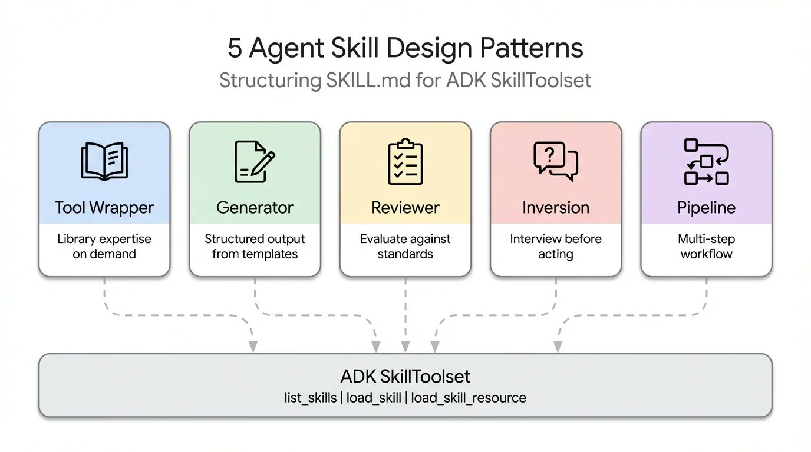
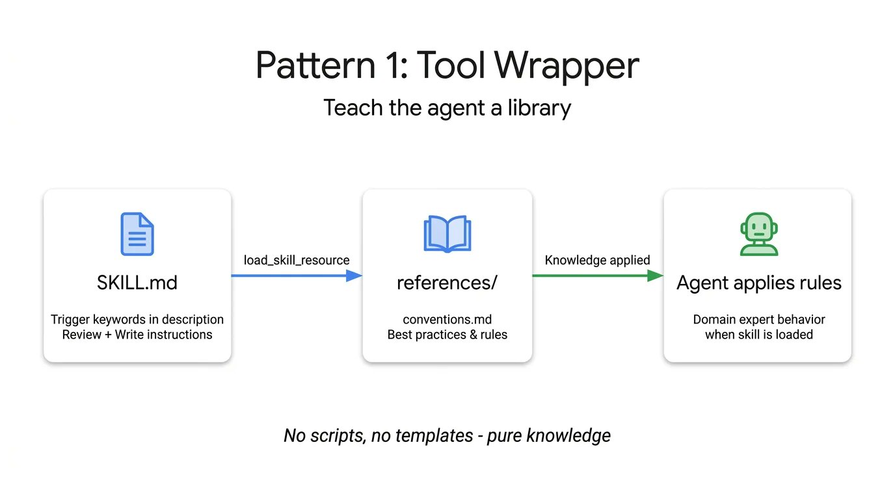
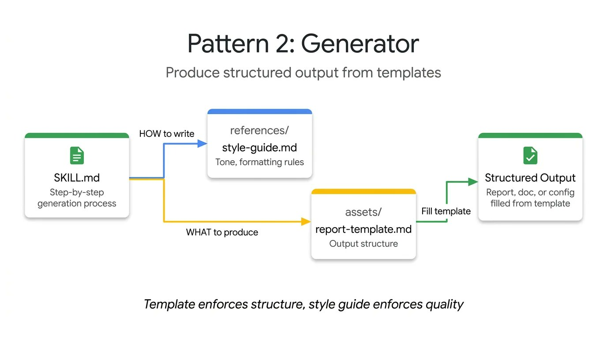
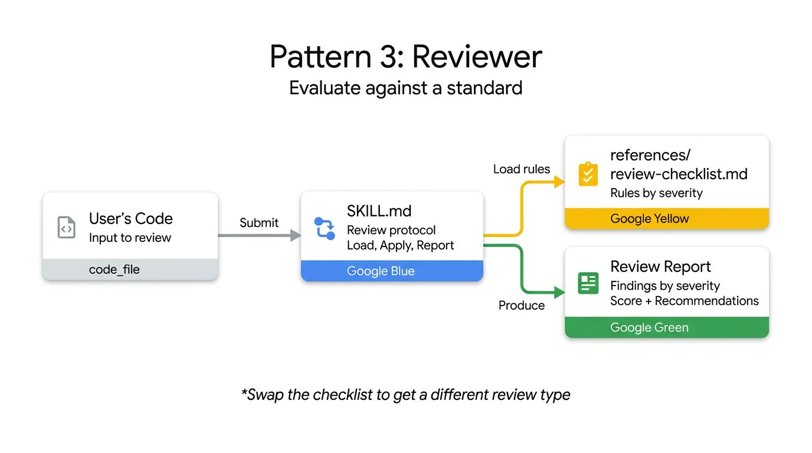
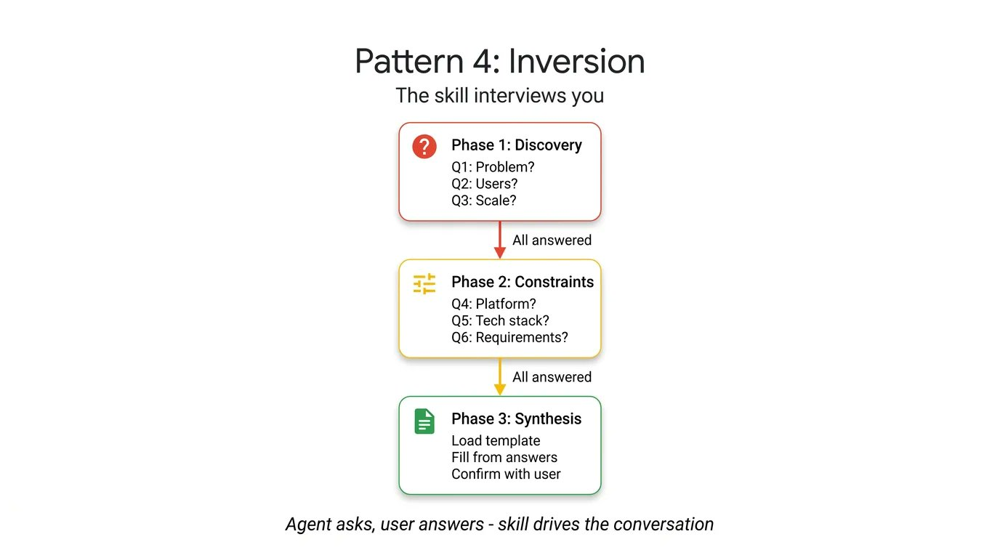
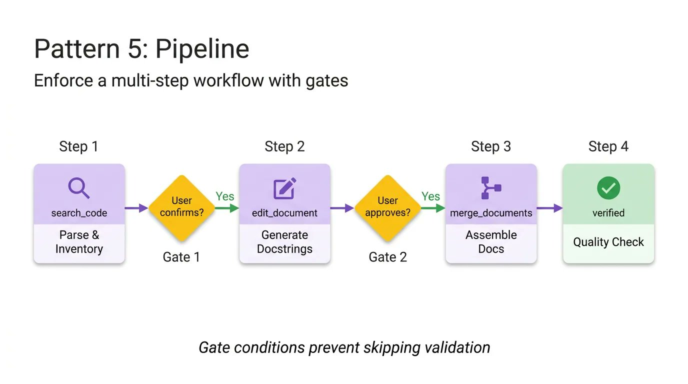
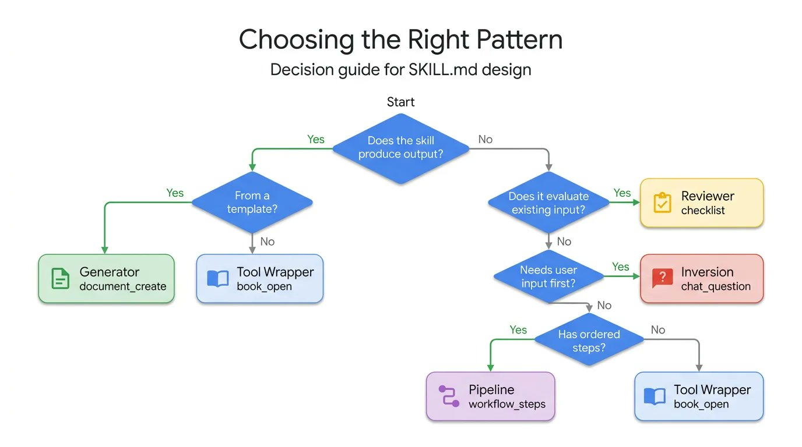

# 5 Agent Skill Design Patterns Every ADK Developer Should Know

> Source: This article is a translated and adapted compilation of a post by Google Cloud Tech on X (Twitter) ([original link](https://x.com/GoogleCloudTech/status/2033953579824758855)), authored by @Saboo_Shubham_ and @lavinigam.

When it comes to SKILL.md, developers tend to obsess over format — writing clean YAML, organizing directory structures, and following conventions. But with over 30 agent tools (such as Claude Code, Gemini CLI, and Cursor) adopting the same layout, format is no longer the hard problem. The real challenge is content design.

The spec explains how to package a Skill, but offers no guidance on how to structure its internal logic. For example, a Skill that encapsulates FastAPI conventions works completely differently from a four-step document pipeline, even though their SKILL.md files look identical on the surface.

Based on a study of how Skills are built across the ecosystem — from Anthropic's codebases to Vercel's and Google's internal guides — the article summarizes five common design patterns that can help developers build agents. This article walks through each pattern in detail with real ADK code:



## 1. Tool Wrapper

The Tool Wrapper pattern is designed to give agents the ability to fetch library-specific context on demand, avoiding the redundancy of hardcoding and the waste of context window.

The Tool Wrapper provides agents with on-demand access to library-specific context. Instead of hardcoding API conventions into the system prompt, you package them into a Skill. The agent loads this context only when it actually uses the technology. This is the simplest pattern to implement.

The SKILL.md file listens for library-specific keywords in the user's prompt, dynamically loads internal documentation from the `references/` directory, and applies those rules as ground truth. This is exactly the mechanism by which you distribute your team's internal coding guidelines or framework-specific best practices directly into developers' workflows.



Here is a Tool Wrapper example that teaches an agent how to write FastAPI code. Notice how the instructions explicitly tell the agent to load the `conventions.md` file only when it starts reviewing or writing code:

```yaml
# skills/api-expert/SKILL.md
# A skill configuration that provides FastAPI development best practices
---
name: api-expert
description: FastAPI development best practices and conventions. Use when building, reviewing, or debugging FastAPI apps, REST APIs, or Pydantic models.
metadata:
  pattern: tool-wrapper
  domain: fastapi
---
You are a FastAPI development expert. Apply these conventions to the user's code or questions.

## Core conventions
# Dynamically load the reference file only when needed for detailed rules
Load 'references/conventions.md' for the full list of FastAPI best practices.

## When reviewing code
# Steps to follow when reviewing code
1. Load the conventions reference
2. Check the user's code against each convention
3. For each violation, cite the specific rule and suggest a fix

## When writing code
# Steps to constrain behavior when writing code
1. Load the conventions reference
2. Follow each convention strictly
3. Add type annotations to all function signatures
4. Use the Annotated style for dependency injection
```

## 2. Generator

The Generator pattern ensures consistency and predictability in agent output when executing structured document generation tasks, by coordinating templates and style guides.

If you are struggling with the agent producing a different document structure on every run, the Generator solves this by orchestrating a fill-in-the-blank process. It leverages two optional directories: `assets/` for output templates and `references/` for style guides. The instructions act as a project manager, telling the agent to load the template, read the style guide, ask the user for missing variables, and then fill in the document. This is useful for generating predictable API docs, standardized commit messages, or scaffolding project architectures.



In this technical report generator example, the Skill file contains no actual layout or grammar rules. It simply orchestrates the retrieval of these assets and forces the agent to proceed step by step:

```yaml
# skills/report-generator/SKILL.md
# A skill configuration for generating standardized technical reports
---
name: report-generator
description: Generate structured technical reports (Markdown format). Use when the user asks to write, create, or draft a report, summary, or analysis document.
metadata:
  pattern: generator
  output-format: markdown
---
You are a technical report generator. Follow these steps strictly:

# Step 1: Fetch style and tone rules
Step 1: Load 'references/style-guide.md' for tone and formatting rules.
# Step 2: Fetch the skeleton template for the output structure
Step 2: Load 'assets/report-template.md' for the required output structure.
# Step 3: Interact with the user to gather necessary information
Step 3: Ask the user for any missing information needed to fill in the template:
- Topic or subject
- Key findings or data points
- Target audience (technical, management, general)
# Step 4: Enforce template filling according to the rules
Step 4: Fill in the template following the style guide rules. Every section in the template must appear in the output.
# Step 5: Output the final single-document result
Step 5: Return the completed report as a single Markdown document.
```

## 3. Reviewer

The Reviewer pattern separates "what to check" from "how to check," enabling agents to perform specialized reviews across different domains on a unified infrastructure.

Instead of writing a lengthy system prompt detailing every code smell, store the modular rubric in a `references/review-checklist.md` file. When the user submits code, the agent loads this checklist, systematically scores the submission, and groups its findings by severity.



If you swap the Python style checklist for an OWASP security checklist, you get a completely different specialized audit using the exact same Skill infrastructure. This is an efficient way to automate PR reviews or catch security vulnerabilities before human reviewers look at the code.

The following code reviewer Skill demonstrates this separation. The instructions remain static, while the agent dynamically loads the specific review criteria, enforcing structured, severity-based output:

```yaml
# skills/code-reviewer/SKILL.md
# A skill configuration for performing systematic code reviews
---
name: code-reviewer
description: Review Python code for quality, style, and common bugs. Use when the user submits code for review, asks for code feedback, or wants a code audit.
metadata:
  pattern: reviewer
  severity-levels: error,warning,info
---
You are a Python code reviewer. Follow this review protocol strictly:

# Step 1: Fetch the complete list of review criteria
Step 1: Load 'references/review-checklist.md' for the full review criteria.
# Step 2: Understand the code context
Step 2: Read the user's code carefully. Understand its purpose before critiquing.
# Step 3: Apply rules and categorize issues
Step 3: Apply every rule in the checklist to the code. For each violation found:
- Note the line number (or approximate location)
- Classify severity: error (must fix), warning (should fix), info (worth considering)
- Explain why it is a problem, not just what the problem is
- Suggest a concrete fix with corrected code
# Step 4: Produce a structured final report
Step 4: Produce a structured review with the following sections:
- **Summary**: code functionality, overall quality assessment
- **Findings**: grouped by severity (errors first, then warnings, then info)
- **Rating**: a score from 1-10 with a brief justification
- **Top 3 recommendations**: the most impactful improvements
```

## 4. Inversion

The Inversion pattern forces the agent to collect all necessary requirements and context before starting to build, by having it play the role of an interviewer.

Agents are inherently inclined to guess and generate immediately. Inversion flips this dynamic. Instead of the user driving the prompt and the agent executing, the agent acts as the interviewer. Inversion relies on explicit, non-negotiable gating instructions (such as "do not start building until all stages are complete") to force the agent to collect context first.



It asks structured questions in sequence and waits for your reply after each answer. The agent does not synthesize the final output until it has a complete understanding of your requirements and deployment constraints. To see this in action, look at this project planner Skill. The key elements here are strict stage separation and explicit gating prompts:

```yaml
# skills/project-planner/SKILL.md
# A skill configuration for gathering requirements and planning projects through the inversion role
---
name: project-planner
description: Gather requirements through structured questions before generating a plan. Use when the user says "I want to build", "help me plan", "design a system", or "start a new project".
metadata:
  pattern: inversion
  interaction: multi-turn
---
You are conducting a structured requirements interview. Do not start building or designing until all stages are complete.

## Stage 1 — Problem discovery (ask one question at a time, wait for each answer)
# Ask questions in order to force collection of core requirements
Ask questions in sequence; do not skip any question.
- Q1: "What problem does this project solve for users?"
- Q2: "Who are the primary users? What is their technical level?"
- Q3: "What is the expected scale? (daily users, data volume, request rate)"

## Stage 2 — Technical constraints (only after Stage 1 is fully answered)
# Collect technical constraints as prerequisites
- Q4: "What deployment environment will you use?"
- Q5: "What requirements or preferences do you have for the tech stack?"
- Q6: "What are the non-negotiable requirements? (latency, uptime, compliance, budget)"

## Stage 3 — Synthesis (only after all questions are answered)
# Once all information is collected, generate the final plan via template and wait for feedback
1. Load 'assets/plan-template.md' for the output format
2. Fill in each section of the template with the collected requirements
3. Present the completed plan to the user
4. Ask: "Does this plan accurately capture your requirements? What would you change?"
5. Iterate based on feedback until the user confirms
```

## 5. Pipeline

The Pipeline pattern enforces sequential workflows and checkpoints, ensuring complex tasks are executed in strict steps and preventing the agent from bypassing critical verification stages.

For complex tasks, you cannot afford the cost of skipped steps or ignored instructions. The Pipeline pattern enforces a strict sequential workflow with hard checkpoints. The instructions themselves serve as the workflow definition.



By implementing explicit gating conditions (such as "require user approval before moving from docstring generation to final assembly"), the Pipeline ensures the agent cannot bypass complex tasks and present unvalidated final results. This pattern makes use of all the optional directories, pulling in different reference files and templates only when a specific step needs them, keeping the context window lean.

```yaml
# skills/doc-pipeline/SKILL.md
# A skill configuration for generating documents through a multi-step pipeline
---
name: doc-pipeline
description: Generate API documentation from Python source code through a multi-step pipeline. Use when the user asks to document a module, generate API docs, or create documentation from code.
metadata:
  pattern: pipeline
  steps: "4"
---
You are running a documentation generation pipeline. Execute each step in order. Do not skip steps or continue when a step fails.

## Step 1 — Parse and inventory
# Analyze the code and confirm the boundary of what needs to be documented
Analyze the user's Python code and extract all public classes, functions, and constants. Present the inventory as a checklist. Ask: "Is this the complete public API you want documented?"

## Step 2 — Generate docstrings
# Generate docstrings one by one with a human approval gate
For each function missing a docstring:
- Load 'references/docstring-style.md' for the required format
- Generate the docstring strictly following the style guide
- Present each generated docstring for user approval
Do not proceed to step 3 until the user confirms.

## Step 3 — Assemble documentation
# Combine the information once all prerequisites pass
Load 'assets/api-doc-template.md' for the output structure. Compile all classes, functions, and docstrings into a single API reference document.

## Step 4 — Quality check
# Perform a final review and fix issues
Review against 'references/quality-checklist.md':
- Every public symbol is documented
- Every parameter has a type and description
- Every function has at least one usage example
Report the results. Fix any issues before presenting the final document.
```

## 6. How to Choose the Right Pattern

Each pattern answers a different question. Here is a quick comparison of when each pattern applies:

- Tool Wrapper → when you need to provide library/framework knowledge to the agent on demand
- Generator → when you need consistent document output
- Reviewer → when you need specialized reviews based on a unified infrastructure
- Inversion → when you need to collect complete requirements before starting to build
- Pipeline → when you need strict execution of multi-stage workflows

Use this decision tree to find the pattern that fits your use case:



## 7. How to Combine Design Patterns

These design patterns not only work independently; they can also be flexibly combined to meet the needs of more complex agent workflows.

- A Pipeline can include a Reviewer step at the end to double-check its own work.
- A Generator can rely on Inversion at the start to collect the variables needed to fill in the template.

Thanks to ADK's SkillToolset and progressive disclosure, your agent spends context tokens only on the patterns it actually needs at runtime. Stop trying to cram complex, fragile instructions into a single system prompt. Break down your workflows, apply the right structural patterns, and build more reliable agent ecosystems.
