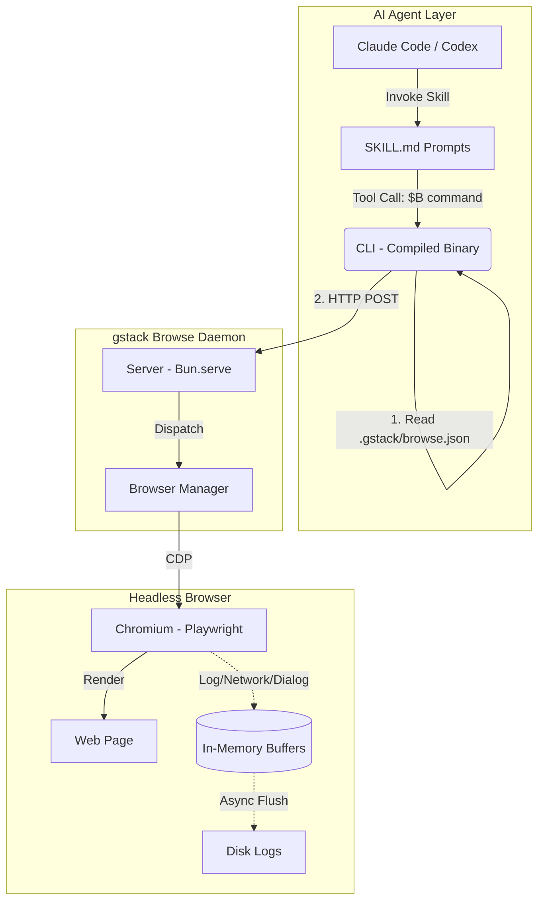
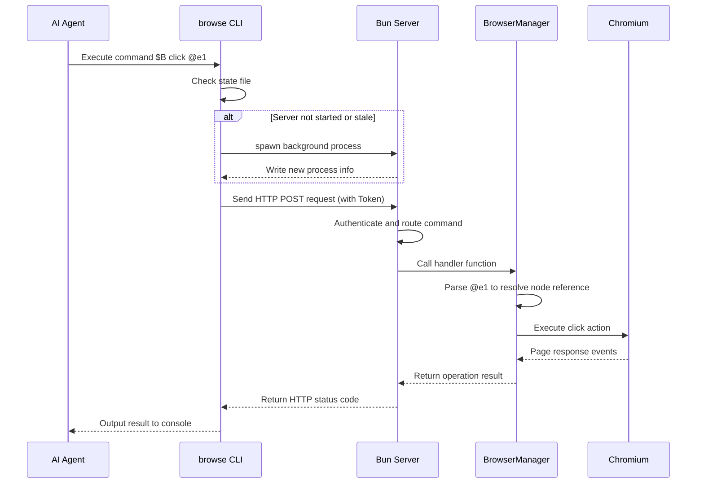

# A Deep Dive into gstack

## Table of Contents

- [1. Project Overview](#1-project-overview)
- [2. System Architecture Analysis](#2-system-architecture-analysis)
  - [2.1 System Architecture Diagram](#21-system-architecture-diagram)
  - [2.2 Key Architecture Design Decisions](#22-key-architecture-design-decisions)
- [3. Core Low-Level Modules](#3-core-low-level-modules)
  - [3.1 Headless Browser Engine (`browse`)](#31-headless-browser-engine-browse)
  - [3.2 Skill Template Compiler (`gen-skill-docs`)](#32-skill-template-compiler-gen-skill-docs)
- [4. Overview of the AI Virtual Engineering Team Skills](#4-overview-of-the-ai-virtual-engineering-team-skills)
  - [4.1 Product Planning Layer](#41-product-planning-layer)
  - [4.2 Quality Assurance Layer](#42-quality-assurance-layer)
  - [4.3 Release & Operations Layer](#43-release--operations-layer)
  - [4.4 Infrastructure Layer](#44-infrastructure-layer)
- [5. Teardown of Representative Skills and Prompt Engineering Best Practices](#5-teardown-of-representative-skills-and-prompt-engineering-best-practices)
  - [5.1 Source-Level Teardown of Representative Skills](#51-source-level-teardown-of-representative-skills)
    - [5.1.1 `/qa`: End-to-End Testing and Fix Loop](#511-qa-end-to-end-testing-and-fix-loop)
    - [5.1.2 `/review`: Architecture-Level Review Beyond Syntax](#512-review-architecture-level-review-beyond-syntax)
    - [5.1.3 `/plan-eng-review`: Injecting Expert-Level Mental Models](#513-plan-eng-review-injecting-expert-level-mental-models)
  - [5.2 Summary of Prompt Engineering Best Practices](#52-summary-of-prompt-engineering-best-practices)
    - [5.2.1 Structured Input Parsing and Defensive Design](#521-structured-input-parsing-and-defensive-design)
    - [5.2.2 Cross-Phase Context Inheritance](#522-cross-phase-context-inheritance)
    - [5.2.3 Injecting Expert-Level "Mental Models"](#523-injecting-expert-level-mental-models)
    - [5.2.4 Dynamic Orchestration and Human-in-the-Loop Interaction](#524-dynamic-orchestration-and-human-in-the-loop-interaction)
- [6. Core Execution Flow Analysis](#6-core-execution-flow-analysis)
  - [6.1 Plain-Text Planning Flows (e.g., `/plan-eng-review`)](#61-plain-text-planning-flows-eg-plan-eng-review)
  - [6.2 System-Operation Flows (e.g., `/qa` with Browser Operations)](#62-system-operation-flows-eg-qa-with-browser-operations)
- [7. Quality and Performance Assessment (Including AI Skill Testing Methodology)](#7-quality-and-performance-assessment-including-ai-skill-testing-methodology)
  - [7.1 System Performance](#71-system-performance)
  - [7.2 AI Skill Testing Methodology (Automated Test Coverage)](#72-ai-skill-testing-methodology-automated-test-coverage)
    - [7.2.1 Tier 1 - Static Validation (Free and Extremely Fast)](#721-tier-1---static-validation-free-and-extremely-fast)
    - [7.2.2 Tier 2 - Real End-to-End Testing (Paid E2E)](#722-tier-2---real-end-to-end-testing-paid-e2e)
    - [7.2.3 Tier 3 - LLM-as-Judge Evaluation](#723-tier-3---llm-as-judge-evaluation)
  - [7.3 Stability and Isolation Design](#73-stability-and-isolation-design)
- [8. Build and Deployment](#8-build-and-deployment)
  - [8.1 Dependency Management and Build Tools](#81-dependency-management-and-build-tools)
  - [8.2 Core Build Pipeline (`bun run build`)](#82-core-build-pipeline-bun-run-build)
  - [8.3 Automated Install and Deploy Script (`setup`)](#83-automated-install-and-deploy-script-setup)
- [9. Quick Start](#9-quick-start)
  - [9.1 Environment Requirements](#91-environment-requirements)
  - [9.2 Global Installation](#92-global-installation)
  - [9.3 Project-Level Configuration (Optional)](#93-project-level-configuration-optional)
  - [9.4 Your First Vibe Coding Sprint](#94-your-first-vibe-coding-sprint)

---

## 1. Project Overview

**gstack** is an open-source AI coding factory and virtual engineering team workflow created by Garry Tan, current President and CEO of Y Combinator. The project is built on a core philosophy: **AI should not work in a single generic cognitive mode — it needs clearly defined role specialization.**

By encapsulating structured software engineering roles (CEO, Engineering Manager, Designer, QA, Release Engineer, etc.) as specific AI skills (Skills), gstack successfully transforms AI coding assistants such as Claude Code into a disciplined virtual engineering team where every member has a well-defined job. Garry Tan himself has publicly stated that with this workflow, while serving as YC CEO, he wrote over 600,000 lines of production-grade code in 60 days on a part-time schedule (10,000–20,000 lines per day). The community has hailed this as "one person with the productivity of a twenty-person engineering team."

Core features of the project include:

- **Role-based workflows (23 core skills)**: Full lifecycle coverage, from product planning (finding 10-star products) and quality assurance (finding deep logical flaws) to release & operations and infrastructure.
- **High-performance headless browser**: The design most praised by the community in gstack's technical architecture. It ships with a persistent browser daemon built on Playwright and Bun. This means AI agents are no longer "blind" — they can perform real web interactions at sub-second latency and maintain login state (Cookies) across commands, enabling automated QA (Quality Assurance) and visual review.
- **Accessibility-tree Ref system**: An innovative use of Playwright's accessibility tree to generate references, achieving element location with zero DOM (Document Object Model) injection, cross-frame compatibility, and SPA (Single Page Application) friendliness.
- **Structured cognitive downshifting**: Community commentary notes that gstack's greatest success lies in separating "plan review" from "code review." When AI tries to do everything at once, it tends to get lost in details or do a perfunctory job; gstack instead forces AI to switch cognitive gears at different stages through explicit `/plan-eng-review` and `/review` steps, producing high-quality architecture diagrams and code.

---

## 2. System Architecture Analysis

gstack's system architecture is primarily divided into two dimensions: the **AI skill dispatch layer** and the **headless browser interaction layer**. To solve the cold-start latency (~2–3 seconds) and state loss (e.g., Cookies, login state) that AI agents encounter when frequently invoking the browser, gstack innovatively introduces a C/S (client/server) daemon model.

We can think of this architecture as a virtual test engineer:

- **Skill dispatch layer (AI brain)**: Plain-text driven; knows "what to test" but has no execution entity.
- **CLI & Daemon (nervous system)**: Receives short commands from the brain (e.g., `$B click @e1`) and delivers them at extreme speed over long-lived HTTP connections.
- **Headless Browser (eyes and hands)**: A resident background executor that renders pages, maintains state (Cookies), and returns results along the same path.

### 2.1 System Architecture Diagram

The entire system achieves strict decoupling from top to bottom: the AI agent at the top issues commands by invoking a locally compiled CLI tool; the CLI acts as a lightweight client communicating with a resident Bun Server over HTTP; the Server drives the underlying Playwright Chromium instance directly via CDP (Chrome DevTools Protocol) and asynchronously flushes logs to disk.



### 2.2 Key Architecture Design Decisions

This section details several key design decisions in the system architecture, including the use of the Bun runtime, the state persistence scheme, and security isolation strategies.

1. **Extreme use of Bun**:
   - Uses `bun build --compile` to package the CLI into a single executable, eliminating runtime `node_modules` dependencies, ~58MB in size.
   - Uses Bun's native SQLite support for Cookie decryption, avoiding the need to compile C++ extensions such as `better-sqlite3`, greatly improving cross-platform compatibility.
   - Uses the built-in `Bun.serve()` to provide a minimal HTTP service handling 20+ core routes, avoiding the overhead of redundant Express/Fastify frameworks.
   - Native TypeScript support: during development you can run `bun run server.ts` directly without precompilation.
2. **Daemon and state persistence**:
   - The server runs as a resident background process; the CLI is just a lightweight wrapper.
   - Maintains login state, LocalStorage, and open tabs, making continuous QA interactions possible for the AI.
   - Dynamic port allocation: randomly assigns a port between 10000 and 60000, allowing multiple Workspaces to run concurrently on the same machine without conflicts.
3. **Security isolation**:
   - The HTTP server binds only to `localhost`, forbidding external network access.
   - A random UUID Token is generated per session (based on `Bearer Auth`) to prevent unauthorized cross-process calls.
   - Cookie import requires system-level Keychain authorization; data is decrypted in memory (PBKDF2 + AES-128-CBC), never written to disk in plaintext, and never appears in any logs.
4. **Accessibility-tree Ref system**:
   - Calls `page.accessibility.snapshot()` to obtain the ARIA (Accessible Rich Internet Applications) tree and assigns sequential numbers to each element (e.g., `@e1`, `@e2`).
   - Builds a Locator for each element and detects whether the element is stale before operations (`count() === 0` throws an exception), solving the frequent failures of traditional CSS selectors with Shadow DOM and framework hydration.
   - **Ref lifecycle and cleanup**: On page navigation (the `framenavigated` event), all Refs are automatically cleaned up. This is a defensive design that requires the agent to re-run `snapshot` after navigation to obtain fresh references, avoiding clicks on wrong or stale elements.
   - Introduces cursor-clickable references (`@c1`, `@c2`), captured via the `-C` flag for elements not present in the ARIA tree but actually clickable by cursor (e.g., divs with `cursor: pointer` or custom `onclick`).
5. **Logging architecture**:
   - Uses three ring buffers, each with a capacity of 50,000 records, storing Console, Network, and Dialog events respectively.
   - O(1) in-memory writes, asynchronously flushed to disk files (every second), ensuring HTTP requests are never blocked by disk I/O.

---

## 3. Core Low-Level Modules

This chapter analyzes the low-level infrastructure modules in the gstack project. Unlike the Markdown-based skill definitions, these modules are developed in TypeScript and are primarily responsible for system-level interactions and automation tasks. Among them, the Headless Browser Engine provides AI agents with the ability to parse and interact with page DOM elements; the Skill Template Compiler is responsible for managing and generating the final skill documents, ensuring configuration consistency across environments.

### 3.1 Headless Browser Engine (`browse`)

This module lives in the `browse/src/` directory and is built on Playwright to run automated browser tasks in the background and expose standard interaction interfaces.

- **Command-line client (`cli.ts`)**
  - **Function**: Provides the communication interface between AI agents and the background browser service.
  - **Logic**: Parses the `.gstack/browse.json` state file to obtain the current daemon's PID, port, and auth Token. When the process is missing or the binary version (`binaryVersion`) has changed, it automatically spawns and initializes `server.ts`, then forwards interaction commands over HTTP POST.
- **HTTP daemon service (`server.ts`)**
  - **Function**: Provides a RESTful API that handles concurrent requests from the CLI and manages system state.
  - **Logic**: Implements page read/write interfaces with a built-in idle timeout policy (releases resources after 30 minutes of inactivity by default). Uses ring buffers to asynchronously persist browser console logs, network request logs, and dialog events to local disk, reducing I/O blocking.
- **Browser lifecycle management (`browser-manager.ts`)**
  - **Function**: Wraps the underlying Playwright instance, uniformly dispatching tabs, browser contexts, and dialog events.
  - **Logic**:
    - Crash recovery: listens for the `disconnected` event and proactively terminates the process when the Chromium instance crashes abnormally, avoiding zombie processes and inconsistent state.
    - Dialog interception: automatically captures and stores dialogs triggered by the page, preventing the automation flow from being blocked.
    - DOM mapping and simplification: maintains a reference mapping of DOM elements, generating short unique identifiers (e.g., `@e1`) for interactive elements on the page, so AI agents can precisely locate and operate on DOM nodes via plain-text commands, avoiding the performance cost of directly processing complex HTML trees.

### 3.2 Skill Template Compiler (`gen-skill-docs`)

This module lives at `scripts/gen-skill-docs.ts` and mainly implements automated building and rendering of skill documents (SKILL.md).

- **Function**: Restricts direct modification of the generated `.md` skill documents, forcing `.tmpl` templates to be converted into final documents through the compilation script, thereby keeping code and documentation synchronized.
- **Logic**: Reads source template files, parses predefined placeholders (including the available command list, system path conventions, etc.), and dynamically injects the appropriate syntax formats and context configuration based on the target runtime environment (e.g., the Claude Code CLI or a custom platform).

---

## 4. Overview of the AI Virtual Engineering Team Skills

This chapter details all the core skills stored in the `.agents/skills/` directory. By defining specific system prompts, allowed tools, and execution hooks, these skills grant AI agents different professional roles. Based on where they apply in the software development lifecycle, these skills can be divided into four core layers: the product planning layer, the quality assurance layer, the release & operations layer, and the infrastructure layer.

### 4.1 Product Planning Layer

Skills in this layer are mainly used in the requirements analysis and architecture design phase before code is written, ensuring clear product goals, sound technical architecture, and consistent design standards.

- **`/office-hours` (Product Diagnosis and Reframing)**
  - **Description**: Plays the role of a startup mentor, using structured questioning to logically reason through and reframe preliminary product ideas.
  - **Allowed tools**: `Bash`, `Read`, `Grep`, `Glob`, `Write`, `Edit`, `AskUserQuestion`.
  - **Use cases**: When starting a new project or planning a major feature module with only an initial concept in hand.
  - **Recommendation**: Invoke this command and briefly describe the pain point. The AI will challenge the underlying assumptions through follow-up questions and finally produce a design doc covering multiple technical implementation paths, laying a contextual foundation for subsequent development.
- **`/plan-ceo-review` (Product Boundary Review)**
  - **Description**: Reviews requirements from a business leader's perspective, focusing on the product's core value and feature boundaries.
  - **Allowed tools**: `Read`, `Grep`, `Glob`, `Bash`, `AskUserQuestion`.
  - **Use cases**: During requirements planning, when evaluating whether a feature should be included in the current iteration or cut down to an MVP (Minimum Viable Product).
  - **Recommendation**: Use it after a draft design doc is produced; it offers multiple scope adjustment modes such as expand, hold, or trim, helping the team make product decisions.
- **`/plan-eng-review` (Engineering Architecture Review)**
  - **Description**: Plays the role of a senior engineering manager, responsible for locking down the technical execution plan and assessing potential risks.
  - **Allowed tools**: `Read`, `Write`, `Grep`, `Glob`, `AskUserQuestion`, `Bash`.
  - **Use cases**: After product requirements are confirmed, before formal coding begins.
  - **Recommendation**: Using this command forces hidden technical assumptions in the system to surface, generates data flow diagrams (ASCII format), and produces a detailed test matrix and failure-mode checklist, reducing architecture risk.
- **`/plan-design-review` (Design Proposal Evaluation)**
  - **Description**: Plays the role of a design review expert, performing multi-dimensional quantitative evaluation of the current visual and interaction design proposals.
  - **Allowed tools**: `Read`, `Edit`, `Grep`, `Glob`, `Bash`, `AskUserQuestion`.
  - **Use cases**: During the planning and design phase of frontend UI or complex interaction changes.
  - **Recommendation**: It scores each design dimension from 0–10 and provides optimization suggestions, helping the team avoid unreasonable or low-quality UI logic.
- **`/design-consultation` (Design System Construction)**
  - **Description**: Plays the role of a senior designer, helping to plan and build a complete Design System from scratch.
  - **Allowed tools**: `Bash`, `Read`, `Write`, `Edit`, `Glob`, `Grep`, `AskUserQuestion`, `WebSearch`.
  - **Use cases**: When a project needs global UI standards, color systems, and component standards established early on.
  - **Recommendation**: Prioritize this in standalone projects lacking standard design specs, to ensure consistency in later frontend development.

### 4.2 Quality Assurance Layer

Skills in this layer run through the code development and testing phases, with the core goals of discovering latent defects, ensuring the robustness of code logic, and precise visual fidelity.

- **`/review` (Code Logic Review)**
  - **Description**: Plays the role of a senior engineer performing deep pre-merge PR (Pull Request) review.
  - **Allowed tools**: `Bash`, `Read`, `Edit`, `Write`, `Grep`, `Glob`, `AskUserQuestion`.
  - **Use cases**: After a feature branch is developed and before merging to the main branch.
  - **Recommendation**: This skill not only finds deep logic flaws that CI (Continuous Integration) cannot intercept, but also attempts to auto-fix obvious syntax or logic errors. Recommended as a mandatory pre-merge step.
- **`/investigate` and `/debug` (Systematic Root-Cause Debugging)**
  - **Description**: Plays the role of a professional debugging expert, strictly following the "no investigation, no fix" principle, systematically tracing data flow and root causes. `/debug` is its common alias.
  - **Allowed tools**: `Bash`, `Read`, `Write`, `Edit`, `Grep`, `Glob`, `AskUserQuestion`.
  - **Execution hooks**: Configures a `PreToolUse` interceptor that automatically runs `check-freeze.sh` before any `Edit` or `Write` execution, enforcing debugging scope boundaries and preventing out-of-bounds modifications.
  - **Use cases**: When encountering complex errors, performance bottlenecks, or unknown bugs during development or runtime.
  - **Recommendation**: Invoke after providing detailed error logs or anomaly descriptions. If the root cause cannot be located after multiple attempts, it will proactively stop to avoid further damage to the system.
- **`/qa` (End-to-End Automated Testing and Fixing)**
  - **Description**: Plays the role of a QA test lead, using the headless browser engine to verify page interactions in a real environment and support automatic defect fixing.
  - **Allowed tools**: `Bash`, `Read`, `Write`, `Edit`, `Glob`, `Grep`, `AskUserQuestion`, `WebSearch`.
  - **Use cases**: After frontend feature development completes, when real DOM interaction verification is needed.
  - **Recommendation**: Enter `/qa <URL>` and it will automatically perform clicks, inputs, and other operations. When issues are found, it fixes the code with atomic commits and re-verifies.
- **`/qa-only` (End-to-End Read-Only Testing)**
  - **Description**: The read-only version of `/qa`; only executes tests and reports, making no code changes.
  - **Allowed tools**: Restricted permissions — only `Bash`, `Read`, `Write`, `AskUserQuestion`; the code editing tool (`Edit`) is disabled.
  - **Use cases**: Production regression testing or feature verification in strictly controlled environments.
  - **Recommendation**: Use when only a defect report is needed and the AI must be prevented from modifying the codebase.
- **`/design-review` (Design Implementation Review and Fixing)**
  - **Description**: Plays the role of a designer with frontend development skills, strictly comparing visual differences between the design requirements and the actually rendered page.
  - **Allowed tools**: `Bash`, `Read`, `Write`, `Edit`, `Glob`, `Grep`, `AskUserQuestion`, `WebSearch`.
  - **Use cases**: Visual fidelity walkthroughs after frontend UI development completes.
  - **Recommendation**: It automatically detects and fixes visual deviations such as margins, typography, or colors, while generating before/after comparison snapshots, improving UI delivery quality.
- **`/codex` (Adversarial Code Review)**
  - **Description**: Invokes an independent large language model (e.g., OpenAI Codex) to provide third-party adversarial code review.
  - **Allowed tools**: `Bash`, `Read`, `Write`, `Glob`, `Grep`, `AskUserQuestion`.
  - **Use cases**: When core modules or high-risk code change and need cross-validation.
  - **Recommendation**: Supports modes such as pass/fail gating and adversarial challenges; combining it with `/review` is recommended for multi-dimensional code evaluation reports.

### 4.3 Release & Operations Layer

Skills in this layer are mainly used for automated management of the version release process and retrospective summaries of project cycles, ensuring efficient and transparent delivery.

- **`/ship` (One-Click Release Pipeline)**
  - **Description**: Plays the role of a release engineer, integrating testing, review, code commits, and PR creation into an automated pipeline.
  - **Allowed tools**: `Bash`, `Read`, `Write`, `Edit`, `Grep`, `Glob`, `AskUserQuestion`, `WebSearch`.
  - **Use cases**: When feature development and local testing are complete and code is ready to be pushed upstream.
  - **Recommendation**: This command automatically syncs the main branch, runs test scripts, checks coverage, and pushes code. For projects lacking test configuration, it proactively guides the initialization of a test framework.
- **`/document-release` (Documentation Sync)**
  - **Description**: Plays the role of a technical documentation engineer, automatically scanning code changes and updating corresponding project docs.
  - **Allowed tools**: `Bash`, `Read`, `Write`, `Edit`, `Grep`, `Glob`, `AskUserQuestion`.
  - **Use cases**: When a feature release (e.g., after using `/ship`) changes project characteristics.
  - **Recommendation**: Invoke after every significant version release to prevent README or other core documentation from going stale.
- **`/retro` (Periodic Retrospective and Analysis)**
  - **Description**: Plays the role of an engineering manager, performing multi-dimensional retrospectives and data analysis of the team's development cycles.
  - **Allowed tools**: `Bash`, `Read`, `Write`, `Glob`, `AskUserQuestion`.
  - **Use cases**: Every Friday, at project milestones, or at the end of major version iterations.
  - **Recommendation**: Automatically aggregates code contributions, release cadence, and test health trends, helping the team identify development bottlenecks and formulate improvement strategies.

### 4.4 Infrastructure Layer

Skills in this layer provide the underlying tools, system configuration entry points, and core security protection mechanisms that support higher-level business logic.

- **`/gstack` (Global Workflow and Browser Entry)**
  - **Description**: The core hub skill of gstack, offering not only rapid headless browser testing capabilities but also context-aware workflow recommendations.
  - **Allowed tools**: Only the basic tools `Bash`, `Read`, `AskUserQuestion`.
  - **Use cases**: Throughout daily development, or when needing to quickly test a page or reproduce a bug.
  - **Recommendation**: As the default interaction entry point, it proactively recommends suitable sub-skills (e.g., `/review` or `/ship`) based on the user's current development stage. To disable proactive recommendations, modify the configuration as prompted.
- **`/browse` (Headless Browser Control)**
  - **Description**: The underlying test engine that gives AI agents "vision" and page interaction capabilities.
  - **Allowed tools**: `Bash`, `Read`, `AskUserQuestion`.
  - **Use cases**: When AI needs to read web page content or perform DOM-level operations.
  - **Recommendation**: Usually invoked automatically by higher-level skills such as `/qa`; developers can also send low-level control commands manually from the terminal via `$B <command>`.
- **`/setup-browser-cookies` (Browser Session Sync)**
  - **Description**: Safely extracts and imports cookies from a local real browser (e.g., Chrome, Arc) into the headless browser environment.
  - **Allowed tools**: `Bash`, `Read`, `AskUserQuestion`.
  - **Use cases**: When testing pages that require login state or internal systems that need to bypass complex authentication flows.
  - **Recommendation**: Invoke before running `/qa` to ensure the headless browser has the correct user authentication context.
- **`/careful` (Destructive Operation Alert)**
  - **Description**: A safety guard that prevents AI agents from executing dangerous commands, intercepting and warning about operations such as `rm -rf` or `DROP TABLE`.
  - **Allowed tools**: Only `Bash`, `Read`.
  - **Execution hooks**: Configures a `PreToolUse` interceptor that automatically runs the `check-careful.sh` script to scan for destructive commands before any `Bash` execution.
  - **Use cases**: When operating production environments, troubleshooting live incidents, or handling sensitive data.
  - **Recommendation**: Actively enable before entering high-risk environments, ensuring every destructive operation passes a manual confirmation step.
- **`/freeze` and `/unfreeze` (Edit Scope Locking)**
  - **Description**: Hard-locks the AI agent's file editing permissions to a specific directory, preventing accidental modification of global code.
  - **Allowed tools**: `Bash`, `Read`, `AskUserQuestion`.
  - **Execution hooks**: `/freeze` configures a `PreToolUse` interceptor that enforces `check-freeze.sh` path permission validation before invoking the `Edit` or `Write` tools.
  - **Use cases**: When refactoring a local module or debugging a single component.
  - **Recommendation**: Use `/freeze` to lock a directory; after completing the task, you must call `/unfreeze` to lift the restriction.
- **`/guard` (Global Maximum Security Mode)**
  - **Description**: Activates both `/careful`'s command alerting and `/freeze`'s edit locking simultaneously.
  - **Execution hooks**: Combines the hooks of both — checking for destructive commands before `Bash` and checking boundary restrictions before `Edit` / `Write`.
  - **Use cases**: Exploratory modifications in extremely sensitive or highly uncertain codebases.
  - **Recommendation**: Provides the strictest operational boundaries for AI agents, ensuring system safety.
- **`/gstack-upgrade` (System Self-Update)**
  - **Description**: Handles version detection and syncing of the gstack toolchain itself.
  - **Allowed tools**: `Bash`, `Read`, `Write`, `AskUserQuestion`.
  - **Use cases**: When a new version notification arrives or when the latest skill templates need to be pulled in.
  - **Recommendation**: Invoke periodically to keep the local environment in sync with upstream features.

---

## 5. Teardown of Representative Skills and Prompt Engineering Best Practices

This chapter analyzes three representative `.tmpl` skill templates (`/qa`, `/review`, `/plan-eng-review`) in depth to show how gstack uses advanced prompt engineering techniques to transform AI from a "passive Q&A bot" into a "proactive engineering partner." Building on this, we summarize reusable prompt design patterns.

### 5.1 Source-Level Teardown of Representative Skills

The following is a detailed analysis of the underlying workflows and prompt designs of gstack's core skills, with excerpts of real template source code (prompt snippets).

#### 5.1.1 `/qa`: End-to-End Testing and Fix Loop

This skill demonstrates how to orchestrate an extremely complex "test-fix-regress" multi-step state machine.

- **Context and defensive initialization**:
  - **Tabular parameter constraints**: The prompt begins with a Markdown table strictly defining the default values and override methods for parameters such as `Target URL`, `Tier`, and `Scope`.
  - **Dirty workspace interception**: Enforces `git status --porcelain`. If the workspace is not clean, it triggers an `AskUserQuestion` asking the user to `Commit` or `Stash`, protecting the subsequent "Atomic Commits" from polluting the code history.

  _Source excerpt (dirty check interception):_

  ```markdown
  **Check for clean working tree:**
  `git status --porcelain`
  If the output is non-empty (working tree is dirty), **STOP** and use AskUserQuestion:
  "Your working tree has uncommitted changes. /qa needs a clean tree so each bug fix gets its own atomic commit."
  ```

- **Cross-phase context inheritance**:
  - Refuses blind scanning. It first reads the test plans generated by `/plan-eng-review` (`*-test-plan-*.md`) from `~/.gstack/projects/` as the test baseline. Only when the test plan is missing does it degrade to `git diff` heuristic analysis.
- **Phased execution and closed loop**:
  - From `Phases 1-6: QA Baseline` (`Phase 1: Initialize` through `Phase 6: Wrap Up`) to `Phase 7: Triage` (filtering bugs by the configured Tier), then to `Phase 8: Fix Loop`, `Phase 9: Final QA`, and `Phase 10: Report`.
  - In the fix loop, "One commit per fix" (one independent commit per bug) is mandatory, with automatic `before/after` screenshot comparisons and regression test writing.

#### 5.1.2 `/review`: Architecture-Level Review Beyond Syntax

This skill demonstrates how to get AI out of the "code formatter" mindset and perform deep business-logic review.

- **Intent vs. deliverable comparison (Scope Drift Detection)**:
  - Traditional AI review usually looks directly at the diff. This skill's `Step 1.5` forces the AI to first read `TODOS.md` or the PR description, extract the "stated intent," and then compare it against the actual code diff, thereby detecting "scope creep" or "missed requirements."

  _Source excerpt (scope drift detection):_

  ```markdown
  ## Step 1.5: Scope Drift Detection

  Before reviewing code quality, check: **did they build what was requested — nothing more, nothing less?**

  1. Read `TODOS.md` (if it exists). Read PR description...
  2. Identify the **stated intent** — what was this branch supposed to accomplish?
  3. Run `git diff origin/<base> --stat` and compare the files changed against the stated intent.
  ```

- **Dynamic knowledge-base injection**:
  - In `Step 2`, dynamically reads the external rule base `.claude/skills/review/checklist.md`, and in `Step 4` performs a "two-pass review." The first pass looks exclusively for critical issues (SQL injection, race conditions); the second pass covers routine issues (hardcoding, test coverage).
- **Mandatory Fix-First workflow**:
  - Classifies all findings into `AUTO-FIX` and `ASK`. Mechanical issues are fixed automatically; architectural or business issues are batched to the user via `AskUserQuestion` with multiple options (including fix suggestions) for decision. This prevents ineffective "report-only, no-fix" reviews.

#### 5.1.3 `/plan-eng-review`: Injecting Expert-Level Mental Models

This skill demonstrates how to inject the intuition and values of a senior human engineer into AI.

- **Hardcoded cognitive patterns**:
  - The prompt directly encodes a dozen-plus principles of "how great engineering managers think," such as "blast radius instinct," "boring by default," the "two-week smell test," and "systems over individuals." This gives the AI a "value system" for judging whether an architecture design is good.

  _Source excerpt (cognitive pattern injection):_

  ```markdown
  ## Cognitive Patterns — How Great Eng Managers Think

  These are not additional checklist items. They are the instincts that experienced engineering leaders develop over years... 2. **Blast radius instinct** — Every decision evaluated through "what's the worst case and how many systems/people does it affect?" 3. **Boring by default** — "Every company gets about three innovation tokens." Everything else should be proven technology. 10. **Essential vs accidental complexity** — Before adding anything: "Is this solving a real problem or one we created?"
  ```

- **Mandatory quantitative interception criteria**:
  - Sets an explicit complexity check: if the plan touches more than 8 files or introduces more than 2 classes, the AI must proactively challenge the plan and suggest reducing the scope.

  _Source excerpt (complexity blocking):_

  ```markdown
  3. **Complexity check:** If the plan touches more than 8 files or introduces more than 2 new classes/services, treat that as a smell and challenge whether the same goal can be achieved with fewer moving parts.
  ```

- **Highly enforced human-in-the-loop interaction**:
  - In the four-dimension review covering architecture, code quality, testing, and performance, each dimension carries a `STOP` directive, forcing the AI to "call AskUserQuestion once per issue" and to include a "cost-benefit assessment" every time — thoroughly breaking the AI's habit of generating long-winded output in one shot.

### 5.2 Summary of Prompt Engineering Best Practices

From the teardown above, we can extract four core design patterns for building advanced AI skills:

#### 5.2.1 Structured Input Parsing and Defensive Design

- **Explicit tabular parameters**: Use tables to clearly define parameter boundaries and defaults, forcing the AI to complete context alignment before executing complex tasks.
- **Environment "dirty check" blocking**: Before executing automated modifications (e.g., auto-commits), probe the environment state with Bash commands (e.g., Git status) and use `AskUserQuestion` to handle anomalies, avoiding destructive behavior.

#### 5.2.2 Cross-Phase Context Inheritance

- **Refuse to "start from scratch"**: Design filesystem contracts (e.g., standardized artifacts under `~/.gstack/projects/`). Downstream skills (e.g., `/qa`) must prioritize reading the outputs of upstream skills (e.g., `/plan-eng-review`), forming a closed information loop.
- **High-dimensional intent validation**: In review tasks, force the AI to first establish an "intent baseline" (by reading TODOs or PR descriptions) and then compare it against the actual code. This pattern dramatically improves the AI's ability to discover business-logic flaws.

#### 5.2.3 Injecting Expert-Level "Mental Models"

- **Deep role enablement**: Merely setting "you are an expert" is not enough. The domain's best practices (e.g., SRE's error budgets, software engineering's DRY principle) must be converted into concrete, verifiable rule lists written into the prompt.
- **Quantify principles**: Convert abstract review criteria into executable, machine-readable metrics (e.g., "more than 8 files triggers an alert"), giving the AI clear anchors for judgment.

#### 5.2.4 Dynamic Orchestration and Human-in-the-Loop Interaction

- **Mandatory staged pauses**: In multi-step complex workflows, make heavy use of directives like `STOP. Call AskUserQuestion.` Let the AI handle the tedious analysis and execution, but firmly return decision-making on critical paths (e.g., whether to refactor, whether to fix a risk) to humans.
- **Non-intrusive information signaling**: By distinguishing `CRITICAL` (must fix or ask) from `INFORMATIONAL` (for reference only) information levels, the review stays rigorous without over-blocking the workflow pipeline.

---

## 6. Core Execution Flow Analysis

This chapter walks through different types of skill commands to show how system components collaborate to fulfill AI agent requests. gstack's execution flows fall roughly into two categories: **plain-text planning (Markdown-driven)** and **system operations (code/browser-driven)**.

### 6.1 Plain-Text Planning Flows (e.g., `/plan-eng-review`)

The core of such skills lies in context reading and mental model injection. The execution flow is as follows:

1. **Environment exploration**: The AI first runs `bash` scripts to read the current branch state and the project directory structure.
2. **Context mounting**: The AI automatically searches for and reads `*-design-*.md` (design docs) generated by upstream phases.
3. **Intent review**: Compares the current code changes against the design doc's intent; if "scope creep" or an excessive number of changed files is detected, triggers `AskUserQuestion` to ask the user whether to reduce the scope.
4. **Output report**: Generates a Markdown report in the format mandated by the prompt, including ASCII architecture diagrams, a test matrix, and security concerns.

### 6.2 System-Operation Flows (e.g., `/qa` with Browser Operations)

Taking the AI agent invoking the `/qa` skill and performing a click on a web page (executing the `$B click @e1` command) as an example, the end-to-end flow involves calls to external processes:



In this flow, thanks to the daemon architecture, only the first call triggers a cold start; subsequent `HTTP POST` interactions are compressed to 100–200 ms of latency.

---

## 7. Quality and Performance Assessment (Including AI Skill Testing Methodology)

This chapter assesses the project's engineering quality across multiple dimensions, including system performance and automated test coverage, and distills best practices for testing AI skills.

### 7.1 System Performance

Thanks to the resident-in-memory daemon architecture, the browser's initial startup takes about 2–3 seconds, but all subsequent commands — DOM interactions, snapshot captures, network requests, and more — are compressed to **100–200 ms** of latency. This lets AI agents "browse" pages as fluidly as humans, dramatically improving the execution efficiency of the `/qa` and `/design-review` skills.

### 7.2 AI Skill Testing Methodology (Automated Test Coverage)

Testing an AI agent with "autonomous thinking and operation capabilities" is a highly challenging engineering problem. gstack provides a textbook-worthy three-tier test architecture (see the `test/` directory):

#### 7.2.1 Tier 1 - Static Validation (Free and Extremely Fast)

This tier validates the basic logic and stability of the underlying core toolchain without depending on external LLM APIs.

- **Mechanism**: Runs traditional unit tests with `bun test`. Before running locally, ensure the underlying dependencies are ready (e.g., run `npx playwright install` to download the Chromium engine).
- **Coverage**: Mainly verifies that the skill document generator (`gen-skill-docs`) works correctly and that the headless browser CLI (`browse/src/`) handles basic logic, path safety, state caching, etc. correctly. The suite contains several hundred test cases and completes in seconds, since no LLM APIs are called.
- **Example run**:

  ```bash
  # Install dependencies and browser engine, then run tests
  bun install && npx playwright install && bun test

  ```

  _Sample test output:_

  ```text
  ✓ Navigation > goto navigates to URL [17.33ms]
  ✓ Content extraction > accessibility returns ARIA tree [24.31ms]
  ✓ Interaction > click on option ref auto-routes to selectOption [50.01ms]
  ✓ CLI lifecycle > dead state file triggers a clean restart [1185.15ms]
  ...
  ```

#### 7.2.2 Tier 2 - Real End-to-End Testing (Paid E2E)

This tier validates the AI agent's actual ability to orchestrate external tools (e.g., the headless browser) and fix issues by simulating a human-AI conversation in a real sandbox environment.

- **Mechanism**: In the test sandbox, uses Node.js's `child_process.spawn` to genuinely launch a `claude -p` command-line process.
- **Coverage**: Feeds the AI a preset conversation and observes whether it correctly invokes various tools (e.g., `$B` browser interaction commands) and whether it successfully discovers and fixes the "deliberately planted bugs" in the sandbox.
- **Cost control**: Uses Git diff to automatically infer which core files changed, running only the affected E2E tests (diff-based test selection), thereby controlling the API cost per run (a full run may cost ~$4).

#### 7.2.3 Tier 3 - LLM-as-Judge Evaluation

Because AI agent output is non-deterministic, this tier introduces a high-intelligence third-party model to quantitatively evaluate the quality and accuracy of the results.

- **Mechanism**: Since AI output is non-deterministic, traditional assertions (`expect(x).toBe(y)`) cannot work. Another LLM (e.g., `claude-sonnet-4-6`) is therefore introduced as the "judge."
- **Coverage**: Via `test/helpers/llm-judge.ts`, the judge model reads and evaluates the QA reports or design docs generated by the AI agent:
  - **Detection rate**: Did it successfully find all the pre-seeded errors?
  - **False positives**: Did it fabricate problems that don't exist (hallucination)?
  - **Clarity and actionability**: Scores the generated document quality on a 1–5 scale.

### 7.3 Stability and Isolation Design

Beyond performance and test coverage, gstack also introduces several mechanisms to ensure process management safety and pure isolation of the test environment.

- **Zombie process prevention**: Strict version validation exists between the CLI and the Server (comparing `git rev-parse HEAD`). Once a binary update is detected, the next invocation automatically kills the old Server and restarts, thoroughly eliminating "process version mismatch" voodoo bugs.
- **State isolation**: Browser testing supports isolated user contexts and allows injecting specific authentication state into the headless browser via `/setup-browser-cookies`, ensuring automated tests run in a real authenticated environment.

---

## 8. Build and Deployment

This chapter details the project's dependency management, build process, and deployment mechanisms. gstack provides a highly automated build script (`setup`) that greatly reduces configuration costs for users.

### 8.1 Dependency Management and Build Tools

The project uses **Bun** as its core package manager and build tool, greatly simplifying toolchain complexity in the Node.js ecosystem:

- **Lightning-fast dependency installation**: `bun install` completes installation of the project's dependencies (mainly `playwright` and `@anthropic-ai/sdk`) in seconds.
- **Built-in bundling capability**: `bun build --compile` compiles TypeScript source (e.g., the headless browser CLI) directly into a single-file binary executable of ~58MB. This means end users don't even need a Node.js environment installed on their machine to run gstack (on macOS/Linux).

### 8.2 Core Build Pipeline (`bun run build`)

Running `bun run build` triggers a chain of automated build actions, including:

1. **Regenerate skill documents**: Runs `gen-skill-docs.ts` to render all `.tmpl` template files into standard `SKILL.md` files, adapting paths to the host environment (Claude or Codex).
2. **Compile binaries**: Compiles entry files such as `browse/src/cli.ts` into `browse/dist/browse`.
3. **Write version marker**: Automatically obtains the current Git commit hash (`git rev-parse HEAD`) and writes it to the `.version` file, for later validation by the zombie process prevention mechanism.

### 8.3 Automated Install and Deploy Script (`setup`)

gstack provides a powerful `setup` bash script that handles complex environment detection and deployment logic:

- **Environment checks and smart rebuilds**: The script checks whether `browse/dist/browse` exists and intelligently decides whether to re-trigger the build by comparing modification times of the source code, `package.json`, or `bun.lock`.
- **Playwright browser detection**: Automatically detects whether Playwright Chromium is available. For Windows users, the script specially handles Bun's pipe-handling bug on Windows (oven-sh/bun#4253) and degrades to using Node.js to launch Chromium.
- **Smart symlink deployment**: The script supports the `--host auto` parameter, automatically detecting whether Claude Code or Codex is installed on the current system and dynamically symlinking the generated skill directories to the corresponding global config directory (e.g., `~/.claude/skills/gstack`). This design ensures convenience of global invocation while allowing developers' modifications in the source directory to take effect live.

---

## 9. Quick Start

This chapter is a guide for users who want to quickly experience the gstack workflow in their own Vibe Coding IDEs (e.g., Cursor, Trae).

### 9.1 Environment Requirements

Before getting started, ensure the current system meets the following baseline environment:

- [Git](https://git-scm.com/) installed.
- [Bun](https://bun.sh/) v1.0+ installed (for compiling the headless browser and generating skill docs).
- On Windows, [Node.js](https://nodejs.org/) is also required.
- The target IDE (e.g., Claude Code, Cursor, Trae) supports agent skill extensions based on the `SKILL.md` standard.

### 9.2 Global Installation

To let the AI assistant invoke gstack's 23 core skills in any project, we recommend installing it into the global `~/.claude/skills` directory.

Open a terminal and run the following commands:

```bash
# Clone the gstack repository to a local directory
git clone https://github.com/garrytan/gstack.git ~/gstack

# Enter the directory and run the automated install script
cd ~/gstack && ./setup --host auto
```

> [!NOTE]
> The `setup` script automatically detects the AI tools installed on the system (e.g., Claude or Codex) and symlinks the compiled binaries and skill templates to the corresponding `~/.claude/skills/gstack` or `~/.codex/skills/gstack` directories.

### 9.3 Project-Level Configuration (Optional)

If you want other team members to have the same AI skill environment right after cloning the repository, you can pin gstack into the current project.

In the project root directory, run:

```bash
# Copy the globally installed gstack into the project's hidden directory
cp -Rf ~/.claude/skills/gstack .claude/skills/gstack

# Remove git history to avoid nested repository issues
rm -rf .claude/skills/gstack/.git

# Rebuild and register the skills inside the project
cd .claude/skills/gstack && ./setup
```

After that, we recommend creating a `CLAUDE.md` (or the IDE's corresponding custom system prompt file) in the project root with the following content, guiding the AI on how to use these skills:

```markdown
# AI Workflow Guide

Please use the skills provided under `.claude/skills/gstack` in this project.

- Use `/office-hours` and `/plan-ceo-review` during the planning phase
- Use `/review` for code review
- Use `/qa` and `/browse` for feature testing, and **never** use the built-in `mcp__claude-in-chrome__*` tools.
```

### 9.4 Your First Vibe Coding Sprint

After installation, open the IDE chat window and try the following "conversation flow" to experience the full gstack closed loop:

1. **Ideation**: Tell the AI `I want to add a user feedback collection popup to the current project, /office-hours`.
2. **Architecture lock**: After reading the design doc, tell the AI `/plan-eng-review`.
3. **Start coding**: Once you agree with the architecture proposal, let the AI write code directly according to the plan.
4. **Test and fix**: After the code is written, tell the AI `/qa http://localhost:3000` (replace with your local dev address) and let it click the popup itself, discover bugs, and fix them.
5. **Prepare to merge**: Tell the AI `/ship` — it will automatically run tests, generate commits, and push to the repository.

---

> This article was written based on a snapshot of the gstack repository from July 2026. The repository is continuously and rapidly evolving, so some data may be outdated.
