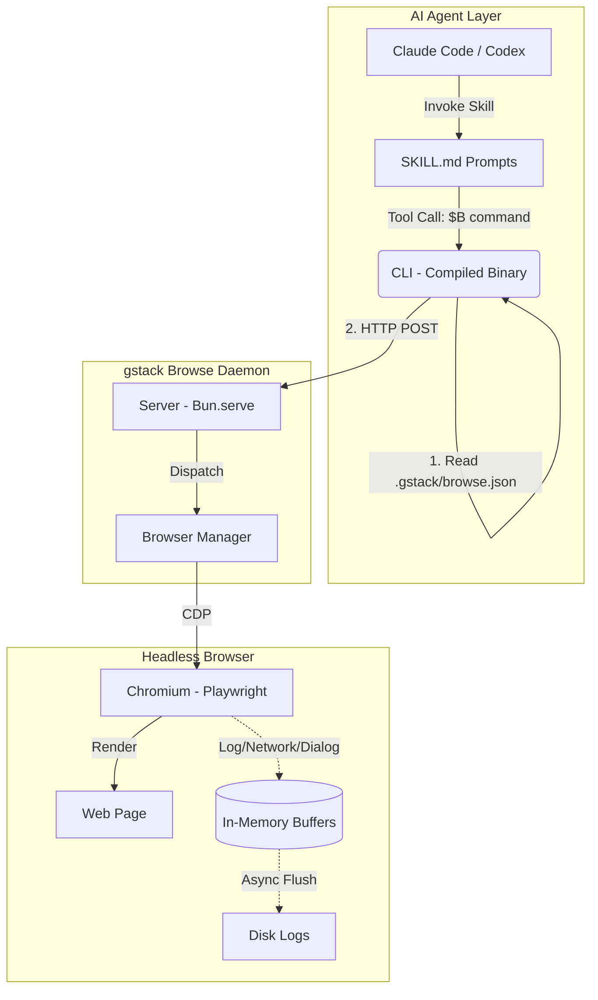
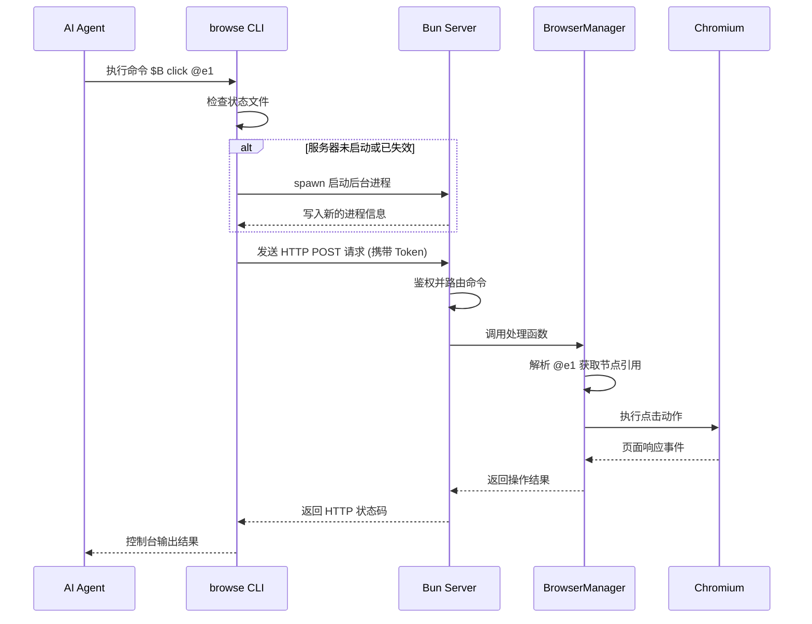

# gstack 项目深度解析报告

## 目录

本文档的结构导航如下，方便快速查阅核心章节：

- [1. 项目简介](#1-项目简介)
- [2. 系统架构分析](#2-系统架构分析)
  - [2.1 系统架构图](#21-系统架构图)
  - [2.2 架构设计要点](#22-架构设计要点)
- [3. 底层核心模块解析](#3-底层核心模块解析)
  - [3.1 无头浏览器引擎 (browse)](#31-无头浏览器引擎-browse)
  - [3.2 技能模板编译系统 (gen-skill-docs)](#32-技能模板编译系统-gen-skill-docs)
- [4. AI 虚拟工程团队技能全景](#4-ai-虚拟工程团队技能全景)
  - [4.1 产品规划层](#41-产品规划层)
  - [4.2 质量保障层](#42-质量保障层)
  - [4.3 发布运营层](#43-发布运营层)
  - [4.4 基础设施层](#44-基础设施层)
- [5. 典型技能拆解与 Prompt 工程最佳实践](#5-典型技能拆解与-prompt-工程最佳实践)
  - [5.1 典型技能源码拆解](#51-典型技能源码拆解)
    - [5.1.1 `/qa`：端到端测试与修复闭环](#511-qa端到端测试与修复闭环)
    - [5.1.2 `/review`：超越语法的架构级审查](#512-review超越语法的架构级审查)
    - [5.1.3 `/plan-eng-review`：注入专家级思维模式](#513-plan-eng-review注入专家级思维模式)
  - [5.2 Prompt 工程最佳实践总结](#52-prompt-工程最佳实践总结)
    - [5.2.1 结构化输入解析与防御性设计 (Defensive Prompting)](#521-结构化输入解析与防御性设计-defensive-prompting)
    - [5.2.2 跨阶段上下文继承 (Context Chaining)](#522-跨阶段上下文继承-context-chaining)
    - [5.2.3 注入专家级“思维模式” (Cognitive Patterns)](#523-注入专家级思维模式-cognitive-patterns)
    - [5.2.4 动态编排与人机交互 (Human-in-the-Loop)](#524-动态编排与人机交互-human-in-the-loop)
- [6. 核心功能执行流程分析](#6-核心功能执行流程分析)
  - [6.1 纯文本规划类流程 (如 `/plan-eng-review`)](#61-纯文本规划类流程-如-plan-eng-review)
  - [6.2 系统操作类流程 (如 `/qa` 结合浏览器操作)](#62-系统操作类流程-如-qa-结合浏览器操作)
- [7. 质量与性能评估 (含 AI 技能测试方法论)](#7-质量与性能评估-含-ai-技能测试方法论)
  - [7.1 系统性能表现](#71-系统性能表现)
  - [7.2 AI 技能测试方法论 (自动化测试覆盖)](#72-ai-技能测试方法论-自动化测试覆盖)
    - [7.2.1 Tier 1 - 静态验证 (免费且极速)](#721-tier-1---静态验证-免费且极速)
    - [7.2.2 Tier 2 - 真实端到端测试 (付费 E2E)](#722-tier-2---真实端到端测试-付费-e2e)
    - [7.2.3 Tier 3 - 大模型裁判评估 (LLM-as-judge)](#723-tier-3---大模型裁判评估-llm-as-judge)
  - [7.3 稳定性与隔离设计](#73-稳定性与隔离设计)
- [8. 项目构建与部署](#8-项目构建与部署)
  - [8.1 依赖管理与构建工具](#81-依赖管理与构建工具)
  - [8.2 核心构建流水线 (bun run build)](#82-核心构建流水线-bun-run-build)
  - [8.3 自动化安装与部署脚本 (setup)](#83-自动化安装与部署脚本-setup)
- [9. 快速入门](#9-快速入门)
  - [9.1 环境要求](#91-环境要求)
  - [9.2 全局安装](#92-全局安装)
  - [9.3 项目级配置 (可选)](#93-项目级配置-可选)
  - [9.4 第一个 Vibe Coding 冲刺](#94-第一个-vibe-coding-冲刺)

---

## 1. 项目简介

**gstack** 是由 Y Combinator 现任总裁兼 CEO Garry Tan 开源的 AI 编程工厂与虚拟工程团队工作流。该项目建立在一个核心哲学之上：**AI 不应该只在一个通用的认知模式下工作，它需要明确的角色分工。**

通过将结构化的软件工程角色（如 CEO、工程经理、设计师、QA、发布工程师等）封装为特定的 AI 技能（Skills），gstack 成功地将 Claude Code 等 AI 编程助手转化为了一支纪律严明、各司其职的虚拟工程团队。Garry Tan 本人曾公开表示，借助这套工作流，他在担任 YC CEO 的同时，以兼职的时间在 60 天内写出了超过 60 万行生产级代码（日均 1-2 万行），这被社区誉为“一个人拥有了一个二十人工程团队的生产力”。

项目的核心特性包括：

- **角色化工作流（21 个核心 Skill）**：提供从产品规划（找寻 10 星级产品）、质量保障（寻找深层逻辑漏洞）、发布运营到基础设施的完整生命周期覆盖。
- **高性能无头浏览器**：这是 gstack 在技术架构上最被社区称道的设计。它内置了基于 Playwright 和 Bun 构建的持久化浏览器守护进程。这使得 AI 代理不再是“瞎子”，能够以亚秒级延迟进行真实的网页交互、跨命令保持登录态（Cookie），从而实现自动化的 QA (Quality Assurance) 与视觉审查。
- **无障碍树 Ref 系统**：创新性地利用 Playwright 的 accessibility tree 生成引用，实现零 DOM (Document Object Model) 注入、跨框架通用、对 SPA (Single Page Application) 友好的元素定位。
- **结构化的认知降维**：社区评价指出，gstack 最大的成功在于分离了“计划评审”与“代码评审”。当 AI 试图一次性做完所有事情时，往往会迷失在细节中或敷衍了事；而 gstack 通过明确的 `/plan-eng-review` 和 `/review` 步骤，迫使 AI 在不同阶段切换认知齿轮，从而产出高质量的架构图和代码。

---

## 2. 系统架构分析

gstack 的系统架构主要分为两个维度：**AI 技能调度层**和**无头浏览器交互层**。为了解决 AI 代理在频繁调用浏览器时遇到的冷启动延迟（约 3-5 秒）和状态丢失（如 Cookie、登录态）问题，gstack 创新性地引入了 C/S 架构的守护进程模型。

我们可以将这套架构理解为一个虚拟的测试工程师：

- **Skill 调度层 (AI 大脑)**：纯文本驱动，知道“要测什么”，但没有执行实体。
- **CLI & Daemon (神经系统)**：接收大脑的短指令（如 `$B click @e1`），并通过 HTTP 长连接极速下发。
- **Headless Browser (眼睛与手)**：常驻后台的真实执行器，负责渲染页面并维持状态（Cookie），将结果原路返回。

### 2.1 系统架构图

整个系统从上至下实现了严格的解耦：最上层的 AI 代理通过调用本地编译的 CLI 工具发出指令，CLI 作为轻客户端通过 HTTP 协议与常驻后台的 Bun Server 通信，而 Server 则利用 CDP (Chrome DevTools Protocol) 直接驱动底层的 Playwright Chromium 实例，并异步处理日志的刷盘落库。



### 2.2 架构设计要点

本小节详细说明系统架构中的几个关键设计决策，包括 Bun 运行时的应用、状态持久化方案以及安全隔离策略。

1. **Bun 的极致应用**：
   - 使用 `bun build --compile` 将 CLI 打包为单一可执行文件，消除运行时的 `node_modules` 依赖，体积约 58MB。
   - 利用 Bun 的原生 SQLite 支持进行 Cookie 解密，无需编译 `better-sqlite3` 等 C++ 扩展，极大提高了跨平台兼容性。
   - 使用内置的 `Bun.serve()` 提供极简的 HTTP 服务，处理约 10 个核心路由，避免了冗余的 Express/Fastify 框架开销。
   - 原生 TypeScript 支持，开发阶段可直接运行 `bun run server.ts`，无需预编译。
2. **守护进程与状态持久化**：
   - Server 端在后台常驻运行，CLI 仅作为轻量级封装。
   - 保持登录态、LocalStorage 和打开的标签页，使得 AI 进行连续的 QA 交互成为可能。
   - 动态端口分配：随机分配 10000-60000 之间的端口，支持同一机器上多个 Workspace 并发运行而无冲突。
3. **安全隔离**：
   - HTTP Server 仅绑定 `localhost`，禁止外部网络访问。
   - 每次会话生成随机 UUID Token（基于 `Bearer Auth`），防止跨进程的未授权调用。
   - Cookie 导入需要系统级的钥匙串（Keychain）授权，数据在内存中解密（PBKDF2 + AES-128-CBC），绝不以明文形式落盘，且不会出现在任何日志中。
4. **无障碍树 Ref 系统**：
   - 调用 `page.accessibility.snapshot()` 获取 ARIA (Accessible Rich Internet Applications) 树，为每个元素分配顺序编号（如 `@e1`, `@e2`）。
   - 为每个元素构建 Locator，操作前检测元素是否过期（`count() === 0` 即抛出异常），解决传统 CSS 选择器在 Shadow DOM、框架水合时频繁失败的问题。
   - **Ref 生命周期与清理**：在页面导航（`framenavigated` 事件）发生时，所有 Ref 会被自动清理。这是一种防御性设计，要求 Agent 在导航后必须重新运行 `snapshot` 获取最新的引用，避免点击到错误或过期的元素。
   - 引入光标可交互引用（`@c1`, `@c2`），通过 `-C` 标志捕捉未在 ARIA 树中但实际可通过光标点击的元素（如带有 `cursor: pointer` 或自定义 `onclick` 的 div）。
5. **日志架构**：
   - 采用三个环形缓冲区（Ring Buffers），每个容量为 50,000 条记录，分别存储 Console、Network 和 Dialog 事件。
   - 内存 O(1) 写入，异步（每秒）刷入磁盘文件，确保 HTTP 请求不被磁盘 I/O 阻塞。

---

## 3. 底层核心模块解析

本章主要分析 gstack 项目中的底层基础设施模块。与基于 Markdown 定义的技能配置不同，底层模块基于 TypeScript 开发，主要负责处理系统级交互与自动化任务。其中，无头浏览器引擎（Headless Browser Engine）为 AI 代理提供了页面 DOM 元素的解析与交互能力；技能模板编译系统（Skill Template Compiler）则负责管理和生成最终的技能文档，确保多环境下的配置一致性。

### 3.1 无头浏览器引擎 (`browse`)

该模块位于 `browse/src/` 目录，基于 Playwright 构建，用于在后台执行自动化浏览器任务，并向外提供标准的交互接口。

- **命令行客户端 (`cli.ts`)**
  - **功能**：提供 AI 代理与后台浏览器服务之间的通信接口。
  - **逻辑**：解析 `.gstack/browse.json` 状态文件以获取当前守护进程的 PID、端口及认证 Token。在进程缺失或二进制文件版本（`binaryVersion`）变更时，自动拉起并初始化 `server.ts`，随后通过 HTTP POST 协议转发交互指令。
- **HTTP 守护服务 (`server.ts`)**
  - **功能**：提供 RESTful API，处理来自 CLI 的并发请求并管理系统状态。
  - **逻辑**：实现页面的读取与写入接口，内置空闲超时策略（默认 30 分钟无操作则释放资源）。采用循环缓冲区（Ring Buffer）机制，将浏览器控制台日志、网络请求日志及弹窗事件异步持久化至本地磁盘，以降低 I/O 阻塞。
- **浏览器生命周期管理 (`browser-manager.ts`)**
  - **功能**：封装底层的 Playwright 实例，统一调度 Tab 页面、浏览器上下文（Context）及对话框事件。
  - **逻辑**：
    - 崩溃恢复机制：通过监听 `disconnected` 事件，在 Chromium 实例异常崩溃时主动终止进程，避免僵尸进程及状态不一致问题。
    - 弹窗拦截：自动捕获并存储页面触发的对话框（Dialog），防止自动化执行流被阻塞。
    - DOM 映射与精简：维护一套 DOM 元素的引用映射关系，为页面上的可交互元素生成简短的唯一标识符（如 `@e1`），使 AI 代理能够通过纯文本指令精准定位和操作 DOM 节点，规避了直接处理复杂 HTML 树的性能损耗。

### 3.2 技能模板编译系统 (`gen-skill-docs`)

该模块位于 `scripts/gen-skill-docs.ts`，主要实现技能文档（SKILL.md）的自动化构建与渲染。

- **功能**：限制对生成的 `.md` 技能文档的直接修改，强制通过编译脚本将 `.tmpl` 模板转换为最终文档，以此保障代码与文档的同步更新。
- **逻辑**：读取源模板文件，解析预设的占位符（包含可用命令列表、系统路径约定等），并根据不同的目标运行环境（例如 Claude Code CLI 或自定义平台）动态注入相应的语法格式与上下文配置。

---

## 4. AI 虚拟工程团队技能全景

本章将详细梳理存放在 `.agents/skills/` 目录下的所有核心技能（Skill）。这些技能通过定义特定的系统提示词（Prompt）、工具权限（Allowed Tools）与执行钩子（Hooks），赋予 AI 代理不同的专业角色。根据在软件开发生命周期中的应用阶段，这些技能可划分为四个核心层级：产品规划层、质量保障层、发布运营层以及基础设施层。

### 4.1 产品规划层

本层技能主要应用于代码编写之前的需求分析与架构设计阶段，旨在确保产品目标明确、技术架构合理且设计规范统一。

- **`/office-hours` (产品诊断与重构)**
  - **说明**：扮演创业导师角色，通过结构化提问对初步的产品想法进行逻辑推演与重构。
  - **工具权限**：允许使用 `Bash`, `Read`, `Grep`, `Glob`, `Write`, `Edit`, `AskUserQuestion`。
  - **使用场景**：启动新项目或规划重大功能模块，且当前仅有初步构想时。
  - **建议**：输入该指令并简述需求痛点，AI 将通过反问挑战预设前提，并最终输出包含多种技术实现路径的设计文档（Design Doc），为后续开发奠定上下文基础。
- **`/plan-ceo-review` (产品边界评审)**
  - **说明**：以企业管理者的视角审视需求，聚焦于产品的核心价值与功能边界。
  - **工具权限**：允许使用 `Read`, `Grep`, `Glob`, `Bash`, `AskUserQuestion`。
  - **使用场景**：需求规划阶段，需要评估功能是否应当纳入当前迭代或削减为 MVP (Minimum Viable Product) 时。
  - **建议**：在生成初步设计文档后使用，它将提供扩展、保持或缩减等多种范围调整模式，协助团队做出产品决策。
- **`/plan-eng-review` (工程架构评审)**
  - **说明**：扮演资深工程经理，负责锁定技术执行计划并评估潜在风险。
  - **工具权限**：允许使用 `Read`, `Write`, `Grep`, `Glob`, `AskUserQuestion`, `Bash`。
  - **使用场景**：产品需求已确认，准备进入正式编码阶段前。
  - **建议**：使用该指令可强制梳理系统中的隐藏技术假设，生成数据流图（ASCII 格式），并输出详尽的测试矩阵与故障模式清单，以降低架构风险。
- **`/plan-design-review` (设计方案评估)**
  - **说明**：扮演设计评审专家，对当前视觉与交互设计方案进行多维度量化评估。
  - **工具权限**：允许使用 `Read`, `Edit`, `Grep`, `Glob`, `Bash`, `AskUserQuestion`。
  - **使用场景**：涉及前端 UI 或复杂交互变更的规划与设计阶段。
  - **建议**：它会对各项设计维度进行 0-10 的打分并提供优化建议，帮助团队规避不合理或劣质的 UI 逻辑。
- **`/design-consultation` (设计系统构建)**
  - **说明**：扮演资深设计师，协助从零开始规划并构建完整的设计系统（Design System）。
  - **工具权限**：允许使用 `Bash`, `Read`, `Write`, `Edit`, `Glob`, `Grep`, `AskUserQuestion`, `WebSearch`。
  - **使用场景**：项目初期需要确立全局 UI 规范、色彩体系及组件标准时。
  - **建议**：在缺乏标准设计规范的独立项目中优先调用，以确保后续前端开发的一致性。

### 4.2 质量保障层

本层技能贯穿于代码开发及测试阶段，核心目标是发现潜在缺陷、保证代码逻辑的健壮性以及 UI 表现的精确还原。

- **`/review` (代码逻辑审查)**
  - **说明**：扮演资深工程师，执行合并前的 PR (Pull Request) 深度审查。
  - **工具权限**：允许使用 `Bash`, `Read`, `Edit`, `Write`, `Grep`, `Glob`, `AskUserQuestion`。
  - **使用场景**：特性分支开发完毕，准备合并至主干分支前。
  - **建议**：该技能不仅能发现 CI (Continuous Integration) 无法拦截的深层逻辑漏洞，还会尝试自动修复明显的语法或逻辑错误，推荐作为代码合并的必选前置环节。
- **`/investigate` 与 `/debug` (系统性根本原因调试)**
  - **说明**：扮演专业调试专家，严格遵循“无调查不修复”的原则，系统性地追踪数据流与根因。`/debug` 为其常用别名。
  - **工具权限**：允许使用 `Bash`, `Read`, `Write`, `Edit`, `Grep`, `Glob`, `AskUserQuestion`。
  - **执行钩子 (Hooks)**：配置了 `PreToolUse` 拦截器，在执行 `Edit` 或 `Write` 之前自动运行 `check-freeze.sh`，强制检查调试范围边界，防止修改越界。
  - **使用场景**：开发或运行过程中遇到复杂错误、性能瓶颈或未知 Bug 时。
  - **建议**：提供详细的报错日志或异常现象后调用。若经过多次尝试仍未定位根因，它会主动停止操作以防止对系统造成进一步破坏。
- **`/qa` (端到端自动化测试与修复)**
  - **说明**：扮演 QA 测试主管，利用无头浏览器引擎在真实环境中验证页面交互，并支持自动修复缺陷。
  - **工具权限**：允许使用 `Bash`, `Read`, `Write`, `Edit`, `Glob`, `Grep`, `AskUserQuestion`, `WebSearch`。
  - **使用场景**：前端功能开发完成后，需进行真实的 DOM 交互验证时。
  - **建议**：输入 `/qa <URL>`，它将自动执行点击、输入等操作。发现问题后，会通过原子提交（Atomic Commit）修复代码并重新验证。
- **`/qa-only` (端到端只读测试)**
  - **说明**：`/qa` 的只读版本，仅执行测试与报告，不进行任何代码修改。
  - **工具权限**：受限权限，仅允许 `Bash`, `Read`, `Write`, `AskUserQuestion`，禁用了代码编辑工具（`Edit`）。
  - **使用场景**：生产环境回归测试或严格受控环境下的功能验证。
  - **建议**：当仅需要缺陷报告而禁止 AI 自动修改代码库时调用。
- **`/design-review` (设计实现审查与修复)**
  - **说明**：扮演具备前端开发能力的设计师，严格对比设计要求与实际渲染页面的视觉差异。
  - **工具权限**：允许使用 `Bash`, `Read`, `Write`, `Edit`, `Glob`, `Grep`, `AskUserQuestion`, `WebSearch`。
  - **使用场景**：前端 UI 开发完成后，进行视觉还原度走查时。
  - **建议**：它会自动发现并修复边距、排版或颜色等视觉偏差，同时生成修改前后的对比快照，提升 UI 交付质量。
- **`/codex` (对抗性代码审查)**
  - **说明**：调用独立的大语言模型（如 OpenAI Codex）提供第三方视角的对抗性代码审查。
  - **工具权限**：允许使用 `Bash`, `Read`, `Write`, `Glob`, `Grep`, `AskUserQuestion`。
  - **使用场景**：核心模块或高风险代码发生变更，需要交叉验证时。
  - **建议**：支持通过/失败门控、对抗性挑战等模式，建议与 `/review` 结合使用以获取多维度的代码评估报告。

### 4.3 发布运营层

本层技能主要用于版本发布流程的自动化管理以及项目周期的复盘总结，确保交付的高效与透明。

- **`/ship` (一键发布流水线)**
  - **说明**：扮演发布工程师，将测试、审查、代码提交与 PR 创建整合为自动化流水线。
  - **工具权限**：允许使用 `Bash`, `Read`, `Write`, `Edit`, `Grep`, `Glob`, `AskUserQuestion`, `WebSearch`。
  - **使用场景**：功能开发与本地测试均已完成，准备向上游提交代码时。
  - **建议**：该指令会自动同步主分支、运行测试脚本、检查覆盖率并推送代码。对于缺乏测试配置的项目，它还会主动引导初始化测试框架。
- **`/document-release` (文档同步更新)**
  - **说明**：扮演技术文档工程师，自动扫描代码变更并更新对应的项目文档。
  - **工具权限**：允许使用 `Bash`, `Read`, `Write`, `Edit`, `Grep`, `Glob`, `AskUserQuestion`。
  - **使用场景**：功能发布（如使用 `/ship` 之后）导致项目特性发生改变时。
  - **建议**：每次重要版本发布后调用，以防止 README 或其他核心文档出现内容滞后。
- **`/retro` (周期回顾与分析)**
  - **说明**：扮演工程经理，对团队开发周期进行多维度的回顾与数据分析。
  - **工具权限**：允许使用 `Bash`, `Read`, `Write`, `Glob`, `AskUserQuestion`。
  - **使用场景**：每周五、项目里程碑或大版本迭代结束时。
  - **建议**：自动汇总代码贡献、连续发布记录及测试健康度趋势，帮助团队识别研发瓶颈并制定改进策略。

### 4.4 基础设施层

本层技能提供了支撑上层业务逻辑运行的底层工具、系统配置入口及核心安全防护机制。

- **`/gstack` (全局工作流与浏览器入口)**
  - **说明**：gstack 的核心中枢技能，不仅提供快速的无头浏览器测试能力，还具备上下文感知的工作流推荐功能。
  - **工具权限**：仅允许基础工具 `Bash`, `Read`, `AskUserQuestion`。
  - **使用场景**：日常开发全过程，或需要快速测试某页面、复现 Bug 时。
  - **建议**：作为默认交互入口，它会根据用户当前所处的开发阶段主动推荐合适的子技能（如 `/review` 或 `/ship`）。若需关闭主动推荐，可按提示修改配置。
- **`/browse` (无头浏览器控制)**
  - **说明**：为 AI 代理提供“视觉”与页面交互能力的底层测试引擎。
  - **工具权限**：允许使用 `Bash`, `Read`, `AskUserQuestion`。
  - **使用场景**：需要 AI 读取网页内容或进行 DOM 级别操作时。
  - **建议**：通常由 `/qa` 等上层技能自动调用，开发者也可通过 `$B <command>` 在终端手动发送底层控制指令。
- **`/setup-browser-cookies` (浏览器会话同步)**
  - **说明**：从本地真实的浏览器（如 Chrome, Arc）中安全提取并导入 Cookie 至无头浏览器环境。
  - **工具权限**：允许使用 `Bash`, `Read`, `AskUserQuestion`。
  - **使用场景**：测试需要登录态的页面或需要绕过复杂认证流程的内部系统时。
  - **建议**：在执行 `/qa` 前调用，以确保无头浏览器具备正确的用户认证上下文。
- **`/careful` (破坏性操作告警)**
  - **说明**：防止 AI 代理执行危险命令的安全护栏，拦截并警告如 `rm -rf` 或 `DROP TABLE` 等操作。
  - **工具权限**：仅允许 `Bash`, `Read`。
  - **执行钩子 (Hooks)**：配置了 `PreToolUse` 拦截器，在执行任何 `Bash` 命令前，自动运行 `check-careful.sh` 脚本扫描破坏性指令。
  - **使用场景**：操作生产环境、排查线上故障或处理敏感数据时。
  - **建议**：进入高危环境前主动开启，确保每一次破坏性操作都经过人工二次确认。
- **`/freeze` 与 `/unfreeze` (编辑范围锁定)**
  - **说明**：将 AI 代理的文件编辑权限硬性锁定在特定目录内，防止其意外修改全局代码。
  - **工具权限**：允许使用 `Bash`, `Read`, `AskUserQuestion`。
  - **执行钩子 (Hooks)**：`/freeze` 配置了 `PreToolUse` 拦截器，在调用 `Edit` 或 `Write` 工具前，强制执行 `check-freeze.sh` 验证路径权限。
  - **使用场景**：进行局部模块重构或仅针对单一组件进行 Debug 时。
  - **建议**：使用 `/freeze` 锁定目录，完成任务后必须调用 `/unfreeze` 解除限制。
- **`/guard` (全局最高安全模式)**
  - **说明**：同时激活 `/careful` 的命令告警与 `/freeze` 的编辑锁定功能。
  - **执行钩子 (Hooks)**：融合了上述两者的钩子机制，在执行 `Bash` 前检查破坏性命令，在执行 `Edit` / `Write` 前检查边界限制。
  - **使用场景**：在极度敏感或高度不确定的代码库中进行探索性修改时。
  - **建议**：为 AI 代理提供最严格的操作边界，保障系统安全。
- **`/gstack-upgrade` (系统自我更新)**
  - **说明**：负责 gstack 工具链本身的版本检测与同步更新。
  - **工具权限**：允许使用 `Bash`, `Read`, `Write`, `AskUserQuestion`。
  - **使用场景**：接收到新版本提示或需要引入最新的技能模板时。
  - **建议**：定期调用以保持本地环境与上游特性的同步。

---

## 5. 典型技能拆解与 Prompt 工程最佳实践

本章将通过深入剖析三个具有代表性的 `.tmpl` 技能模板（`/qa`, `/review`, `/plan-eng-review`），展示 gstack 是如何通过高级 Prompt 工程技术，将 AI 从“被动问答机器人”转化为“主动工程伙伴”的。在此基础上，我们将总结出可复用的 Prompt 设计模式。

### 5.1 典型技能源码拆解

以下是对 gstack 核心技能底层工作流与 Prompt 设计的详细分析，并附带了部分真实的模板源码（Prompt 节选）。

#### 5.1.1 `/qa`：端到端测试与修复闭环

该技能展示了如何编排一个极其复杂的“测试-修复-回归”多步状态机。

- **上下文与防御性初始化**：
  - **表格化参数约束**：Prompt 开头使用 Markdown 表格严格定义了 `Target URL`, `Tier`, `Scope` 等参数的默认值与覆盖方式。
  - **脏工作区拦截**：强制执行 `git status --porcelain`。若工作区不干净，会触发 `AskUserQuestion` 要求用户 `Commit` 或 `Stash`，以此保护后续的“原子提交（Atomic Commits）”不污染代码历史。

  _源码节选（脏检查拦截）：_

  ```markdown
  **Check for clean working tree:**
  `git status --porcelain`
  If the output is non-empty (working tree is dirty), **STOP** and use AskUserQuestion:
  "Your working tree has uncommitted changes. /qa needs a clean tree so each bug fix gets its own atomic commit."
  ```

- **跨阶段上下文继承**：
  - 拒绝盲目扫描。它会优先去 `~/.gstack/projects/` 读取由 `/plan-eng-review` 生成的测试计划（`*-test-plan-*.md`），以此作为测试基准。仅当测试计划缺失时，才降级使用 `git diff` 启发式分析。
- **阶段化执行与闭环**：
  - 从 `Phase 1-6: QA Baseline` 到 `Phase 7: Triage`（基于设定的 Tier 过滤 Bug），再到 `Phase 8: Fix Loop`。
  - 在修复循环中，强制规定“One commit per fix”（每个 Bug 一个独立提交），并自动执行 `before/after` 截图比对与回归测试编写。

#### 5.1.2 `/review`：超越语法的架构级审查

该技能展示了如何让 AI 摆脱“代码格式检查器”的局限，进行深度业务逻辑审查。

- **意图 vs 交付物对比 (Scope Drift Detection)**：
  - 传统 AI 审查通常直接看 Diff。而该技能的 `Step 1.5` 强制要求 AI 先读取 `TODOS.md` 或 PR 描述，提取“声明的意图（Stated Intent）”，再对比实际的代码 Diff。以此来侦测“范围蔓延（Scope Creep）”或“需求遗漏”。

  _源码节选（范围蔓延检测）：_

  ```markdown
  ## Step 1.5: Scope Drift Detection

  Before reviewing code quality, check: **did they build what was requested — nothing more, nothing less?**

  1. Read `TODOS.md` (if it exists). Read PR description...
  2. Identify the **stated intent** — what was this branch supposed to accomplish?
  3. Run `git diff origin/<base> --stat` and compare the files changed against the stated intent.
  ```

- **动态知识库注入**：
  - 在 `Step 2` 动态读取外部规则库 `.claude/skills/review/checklist.md`，并在 `Step 4` 执行“双通道审查（Two-pass review）”。第一遍专查致命问题（SQL 注入、竞态条件），第二遍查常规问题（硬编码、测试覆盖）。
- **强制的 Fix-First 工作流**：
  - 将所有发现分为 `AUTO-FIX` 和 `ASK` 两类。对于机械性问题自动修复；对于架构或业务问题，通过 `AskUserQuestion` 将多个选项（附带修复建议）批量抛给用户决策。防止了“只报不修”的无效审查。

#### 5.1.3 `/plan-eng-review`：注入专家级思维模式

该技能展示了如何为 AI 注入高级人类工程师的直觉和价值观。

- **认知模式 (Cognitive Patterns) 硬编码**：
  - Prompt 中直接写入了 15 条“优秀工程经理如何思考”的准则。例如：“爆炸半径直觉”、“默认选择无聊技术（Boring by default）”、“两周异味测试”以及“系统优于个人”。这赋予了 AI 评判架构设计好坏的“价值观”。

  _源码节选（认知模式注入）：_

  ```markdown
  ## Cognitive Patterns — How Great Eng Managers Think

  These are not additional checklist items. They are the instincts that experienced engineering leaders develop over years... 2. **Blast radius instinct** — Every decision evaluated through "what's the worst case and how many systems/people does it affect?" 3. **Boring by default** — "Every company gets about three innovation tokens." Everything else should be proven technology. 10. **Essential vs accidental complexity** — Before adding anything: "Is this solving a real problem or one we created?"
  ```

- **强制的量化拦截标准**：
  - 设置了明确的复杂度拦截器（Complexity check）：如果方案涉及修改超过 8 个文件或新增 2 个类，AI 必须主动提出质疑并建议缩减范围。

  _源码节选（复杂度阻断）：_

  ```markdown
  3. **Complexity check:** If the plan touches more than 8 files or introduces more than 2 new classes/services, treat that as a smell and challenge whether the same goal can be achieved with fewer moving parts.
  ```

- **高强制性的人机交互**：
  - 在架构、代码质量、测试、性能四个维度的审查中，每个维度都附带了 `STOP` 指令。强制要求 AI “每个问题单独调用一次 AskUserQuestion”，且必须包含“投入产出比评估”，彻底打破了 AI 喜欢一次性生成长篇大论的坏习惯。

### 5.2 Prompt 工程最佳实践总结

通过上述拆解，我们可以提取出设计高级 AI 技能的四个核心设计模式：

#### 5.2.1 结构化输入解析与防御性设计 (Defensive Prompting)

- **参数显式表格化**：使用表格明确定义参数的边界与默认值，强迫 AI 在执行复杂任务前完成上下文对齐。
- **环境“脏检查”阻断**：在执行自动化修改（如自动 Commit）前，必须通过 Bash 命令探测环境状态（如 Git 状态），并使用 `AskUserQuestion` 处理异常，避免破坏性行为。

#### 5.2.2 跨阶段上下文继承 (Context Chaining)

- **拒绝“从零开始”**：设计文件系统契约（如 `~/.gstack/projects/` 下的标准化产物）。下游技能（如 `/qa`）必须优先读取上游技能（如 `/plan-eng-review`）的输出，形成信息流闭环。
- **高维意图校验**：在审查类任务中，强制 AI 先建立“意图基准”（通过读取 TODO 或 PR 描述），再对比实际代码。这种模式极大提升了 AI 发现业务逻辑漏洞的能力。

#### 5.2.3 注入专家级“思维模式” (Cognitive Patterns)

- **角色深层赋能**：仅仅设定“你是一个专家”是不够的，必须将该领域的最佳实践（如 SRE 的错误预算、软件工程的 DRY 原则）转化为具体的、可验证的规则列表写入 Prompt。
- **原则量化**：将抽象的评审标准转化为可执行的机器指标（如“超过 8 个文件即触发告警”），让 AI 的判断有明确的锚点。

#### 5.2.4 动态编排与人机交互 (Human-in-the-Loop)

- **阶段性强制停顿**：在多步复杂工作流中，大量使用类似 `STOP. Call AskUserQuestion.` 的指令。让 AI 负责繁琐的分析与执行，但将关键路径（如是否重构、是否修复某个风险）的决策权牢牢交还给人类。
- **非侵入式的信息提示**：通过区分 `CRITICAL`（必须修复或询问）和 `INFORMATIONAL`（仅供参考）的信息层级，既保证了审查的严谨性，又不会过度阻塞工作流水线。

---

## 6. 核心功能执行流程分析

本章节通过梳理不同类型的技能指令，展示系统各组件如何协同工作以完成 AI 代理的请求。gstack 的执行流程大致可分为两类：**纯文本规划类（Markdown 驱动）**与**系统操作类（代码/浏览器驱动）**。

### 6.1 纯文本规划类流程 (如 `/plan-eng-review`)

这类技能的核心在于上下文的读取与思维模式的注入，其执行流程如下：

1. **环境探查**：AI 首先运行 `bash` 脚本读取当前分支状态、项目目录结构。
2. **上下文挂载**：AI 自动搜索并读取上游环节生成的 `*-design-*.md`（设计文档）。
3. **意图审查**：比对当前代码修改与设计文档的意图，如果发现“范围蔓延”或修改文件过多，触发 `AskUserQuestion` 询问用户是否缩减范围。
4. **输出报告**：按照 Prompt 强制要求的格式，生成包含 ASCII 架构图、测试矩阵和安全隐患的 Markdown 报告。

### 6.2 系统操作类流程 (如 `/qa` 结合浏览器操作)

以 AI 代理调用 `/qa` 技能并在网页中执行点击操作（执行 `$B click @e1` 命令）为例，其端到端涉及到了外部进程的调用：



在这个流程中，得益于守护进程架构，只有第一次调用会触发冷启动，后续的 `HTTP POST` 交互将延迟压缩在了 100~200ms 内。

---

## 7. 质量与性能评估 (含 AI 技能测试方法论)

本章节从系统性能表现、自动化测试覆盖率两个维度对项目的工程质量进行综合评估，并提炼出测试 AI Skill 的最佳实践。

### 7.1 系统性能表现

得益于常驻内存的守护进程架构，浏览器的首次启动时间约为 2 到 3 秒，但后续所有的 DOM 交互、快照截取和网络请求等命令的延迟均被压缩至 **100 到 200 毫秒** 之间。这使得 AI 代理可以像人类一样流畅地“浏览”页面，极大地提升了 `/qa` 和 `/design-review` 技能的执行效率。

### 7.2 AI 技能测试方法论 (自动化测试覆盖)

测试一个具有“自主思考和操作能力”的 AI Agent 是一项极具挑战的工程。gstack 提供了一个堪称教科书级别的三层测试架构（参见 `test/` 目录）：

#### 7.2.1 Tier 1 - 静态验证 (免费且极速)

本层级测试旨在不依赖外部大模型接口的情况下，快速验证底层核心工具链的基础逻辑与稳定性。

- **机制**：使用 `bun test` 执行传统的单元测试。在本地运行前，需确保底层依赖已就绪（如执行 `npx playwright install` 下载 Chromium 内核）。
- **内容**：主要验证技能文档的生成器（`gen-skill-docs`）是否正常工作，以及无头浏览器 CLI 工具（`browse/src/`）的基础逻辑、路径安全、状态缓存等是否正确。整个测试集包含几百个用例，由于不调用任何 LLM 接口，几秒内即可极速完成。
- **执行示例**：

  ```bash
  # 安装依赖与浏览器内核后执行测试
  bun install && npx playwright install && bun test

  ```

  _部分测试输出示例：_

  ```text
  ✓ Navigation > goto navigates to URL [17.33ms]
  ✓ Content extraction > accessibility returns ARIA tree [24.31ms]
  ✓ Interaction > click on option ref auto-routes to selectOption [50.01ms]
  ✓ CLI lifecycle > dead state file triggers a clean restart [1185.15ms]
  ...
  ```

#### 7.2.2 Tier 2 - 真实端到端测试 (付费 E2E)

本层级测试通过在真实的沙箱环境中模拟人类与 AI 代理的对话，验证其对外部工具（如无头浏览器）的实际调度与问题修复能力。

- **机制**：在测试沙箱中，使用 Node.js 的 `child_process.spawn` 真实唤起 `claude -p` 命令行进程。
- **内容**：喂给 AI 一段预设的对话，观察它是否能正确调用各种工具（如 `$B` 浏览器交互命令），是否能成功发现并修复沙盒中“故意植入的 Bug”。
- **控制成本**：通过 Git Diff 自动推断哪些核心文件发生了改变，只运行受影响的 E2E 测试（Diff-based test selection），从而控制每次运行的 API 调用成本（全量跑一次可能花费 ~$4）。

#### 7.2.3 Tier 3 - 大模型裁判评估 (LLM-as-judge)

针对 AI 代理输出内容具有非确定性的特点，本层级测试引入了高智能的第三方模型来量化评估结果的质量和准确性。

- **机制**：由于 AI 的输出具有非确定性（Non-deterministic），传统的断言（`expect(x).toBe(y)`）无法生效。因此引入另一个大模型（如 `claude-sonnet-4-6`）作为“裁判”。
- **内容**：通过 `helpers/llm-judge.ts`，裁判模型会读取并评估 AI 代理生成的 QA 报告或设计文档：
  - **发现率 (Detection Rate)**：是否成功找出了所有预埋的错误？
  - **误报率 (False Positives)**：是否凭空捏造了不存在的问题（幻觉）？
  - **清晰度与可操作性**：对生成的文档质量进行 1-5 分的量化打分。

### 7.3 稳定性与隔离设计

除了性能和测试覆盖率外，gstack 在设计上还引入了多项机制，以确保进程管理的安全性和测试环境的纯净隔离。

- **防僵尸进程机制**：CLI 与 Server 之间存在严格的版本校验机制（比对 `git rev-parse HEAD`）。一旦检测到二进制文件更新，下一次调用会自动杀死旧 Server 并重启，彻底杜绝了“进程版本不一致”导致的玄学 Bug。
- **状态隔离**：浏览器测试支持隔离的用户上下文，并允许通过 `/setup-browser-cookies` 将特定的认证状态注入到无头浏览器中，确保自动化测试能够在真实的鉴权环境下运行。

---

## 8. 项目构建与部署

本章节详细说明项目的依赖管理、构建流程以及部署机制。gstack 提供了一套高度自动化的构建脚本（`setup`），极大降低了用户的配置成本。

### 8.1 依赖管理与构建工具

项目使用 **Bun** 作为核心的包管理器和构建工具，极大简化了 Node.js 生态下的工具链复杂度：

- **极速依赖安装**：通过 `bun install` 可以在秒级完成项目所需依赖（主要是 `playwright` 和 `@anthropic-ai/sdk`）的安装。
- **内置打包能力**：利用 `bun build --compile` 直接将 TypeScript 源码（如无头浏览器 CLI）编译为体积约 58MB 的单文件二进制可执行程序。这意味着最终用户在运行 gstack 时，甚至不需要在机器上安装 Node.js 环境。

### 8.2 核心构建流水线 (`bun run build`)

执行 `bun run build` 会触发一连串的自动化构建动作，具体包括：

1. **重新生成技能文档**：运行 `gen-skill-docs.ts`，将所有的 `.tmpl` 模板文件渲染为标准的 `SKILL.md`，并根据宿主环境（Claude 或 Codex）适配路径。
2. **编译二进制文件**：将 `browse/src/cli.ts` 等入口文件编译打包至 `browse/dist/browse`。
3. **写入版本标识**：自动获取当前的 Git 提交哈希（`git rev-parse HEAD`）并写入 `.version` 文件，供后续的防僵尸进程机制校验使用。

### 8.3 自动化安装与部署脚本 (`setup`)

gstack 提供了一个强大的 `setup` bash 脚本，用于处理复杂的环境探测和部署逻辑：

- **环境检查与智能重建**：脚本会检查 `browse/dist/browse` 是否存在，并通过比对源码、`package.json` 或 `bun.lock` 的修改时间来智能决定是否需要重新触发构建流程。
- **Playwright 浏览器探测**：自动检测 Playwright Chromium 是否可用。对于 Windows 用户，脚本还特别处理了 Bun 在 Windows 下的管道处理 Bug（oven-sh/bun#4253），降级使用 Node.js 来拉起 Chromium。
- **智能软链接部署**：脚本支持 `--host auto` 参数，能够自动探测当前系统安装的是 Claude Code 还是 Codex，并将生成的技能目录动态软链接（Symlink）到对应的全局配置目录（如 `~/.claude/skills/gstack`）下。这种设计既保证了全局调用的便利性，又方便了开发者在源码目录进行修改后的实时生效。

---

## 9. 快速入门

本章节为希望在自己的 Vibe Coding IDE (如 Cursor, Trae 等) 中快速体验 gstack 工作流的用户提供指南。

### 9.1 环境要求

在开始之前，请确保当前系统满足以下基础环境：

- [Git](https://git-scm.com/) 已安装。
- [Bun](https://bun.sh/) v1.0+ 已安装（用于编译无头浏览器与生成技能文档）。
- 对于 Windows 环境，还需要安装 [Node.js](https://nodejs.org/)。
- 目标 IDE（如 Claude Code, Cursor, Trae）支持基于 `SKILL.md` 标准的 Agent 技能扩展。

### 9.2 全局安装

为了让 AI 助手在任何项目中都能调用 gstack 的 21 个核心技能，推荐将其安装到全局的 `.agents/skills` 目录中。

打开终端，执行以下命令：

```bash
# 克隆 gstack 仓库到本地目录
git clone https://github.com/garrytan/gstack.git ~/gstack

# 进入目录并执行自动化安装脚本
cd ~/gstack && ./setup --host auto
```

> [!NOTE]
> `setup` 脚本会自动检测系统中已安装的 AI 工具（如 Claude 或 Codex），并将编译好的二进制文件及技能模板软链接到对应的 `~/.claude/skills/gstack` 或 `~/.codex/skills/gstack` 目录下。

### 9.3 项目级配置 (可选)

如果希望团队的其他成员在 clone 代码仓库时，能直接拥有同样的 AI 技能环境，可以将 gstack 固化到当前项目中。

在项目根目录下执行：

```bash
# 将全局安装的 gstack 复制到当前项目的隐藏目录下
cp -Rf ~/.claude/skills/gstack .claude/skills/gstack

# 移除 git 历史，避免嵌套仓库问题
rm -rf .claude/skills/gstack/.git

# 重新在项目内构建并注册技能
cd .claude/skills/gstack && ./setup
```

随后，建议在项目根目录创建一个 `CLAUDE.md`（或 IDE 对应的自定义系统提示词文件），加入以下内容，指导 AI 如何使用这些技能：

```markdown
# AI 工作流指南

请使用项目中 `.claude/skills/gstack` 下提供的技能。

- 规划阶段请使用 `/office-hours` 和 `/plan-ceo-review`
- 审查代码请使用 `/review`
- 测试功能请使用 `/qa` 和 `/browse`，**绝对不要**使用自带的 `mcp__claude-in-chrome__*` 工具。
```

### 9.4 第一个 Vibe Coding 冲刺

安装完成后，打开 IDE 聊天窗口，尝试以下的“对话流”来体验完整的 gstack 闭环：

1. **构思阶段**：告诉 AI `我想在现在的项目中增加一个用户反馈收集的弹窗，/office-hours`。
2. **架构锁定**：看完设计文档后，告诉 AI `/plan-eng-review`。
3. **开始编码**：同意架构方案后，让 AI 直接根据计划编写代码。
4. **测试与修复**：代码写完后，告诉 AI `/qa http://localhost:3000`（替换为本地开发地址），让它自己去点击弹窗，发现 Bug 并修复。
5. **准备合并**：告诉 AI `/ship`，它会自动运行测试、生成 Commit 并推送到仓库。
