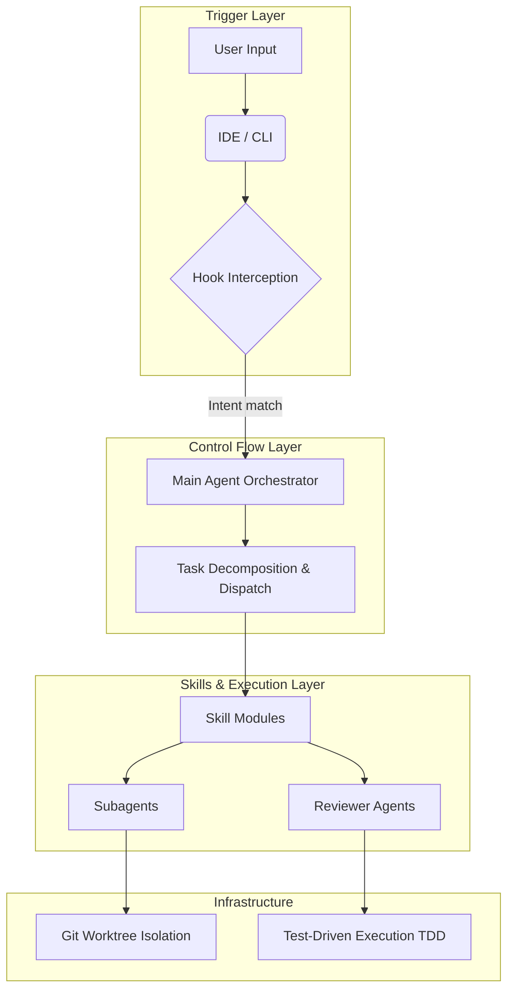
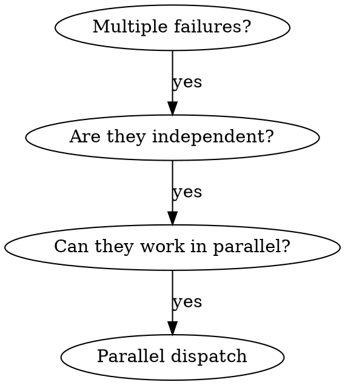
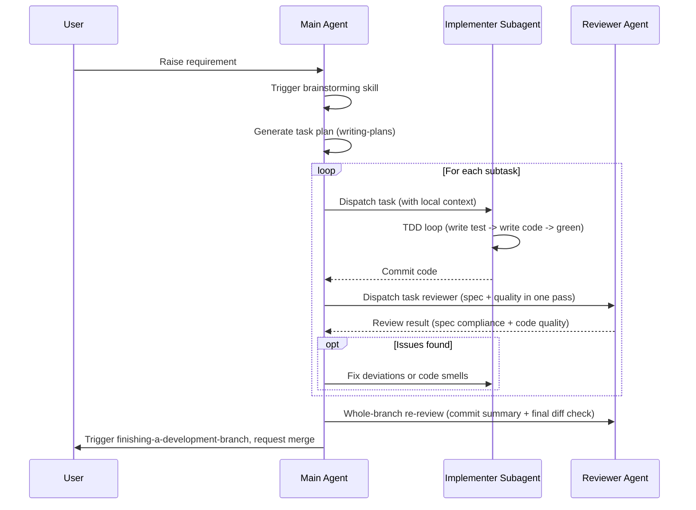

# Turning AI into an Engineering Team: An In-Depth Analysis of the Architecture and Practice of the superpowers Workflow

## Table of Contents

- [1. Project Introduction](#1-project-introduction)
- [2. System Architecture Analysis](#2-system-architecture-analysis)
- [3. In-Depth Analysis of Core Module Code](#3-in-depth-analysis-of-core-module-code)
  - [3.1 Anatomy of the Skill Module Structure](#31-anatomy-of-the-skill-module-structure)
  - [3.2 Agent Definition Module](#32-agent-definition-module)
  - [3.3 Hooks and Commands Module](#33-hooks-and-commands-module)
- [4. Analysis of Core Feature Execution Flow](#4-analysis-of-core-feature-execution-flow)
  - [4.1 Task Planning and Brainstorming](#41-task-planning-and-brainstorming)
  - [4.2 Task Dispatch and Code Implementation](#42-task-dispatch-and-code-implementation)
  - [4.3 Quality Review and Code Merge](#43-quality-review-and-code-merge)
- [5. Testing Methods for Skill Documentation](#5-testing-methods-for-skill-documentation)
  - [5.1 Test-Driven Skill Development](#51-test-driven-skill-development)
  - [5.2 Test Execution and Verification](#52-test-execution-and-verification)
- [6. Hands-On Walkthrough: Building a New Feature with Superpowers](#6-hands-on-walkthrough-building-a-new-feature-with-superpowers)
  - [6.1 Phase 1: Requirement Clarification and Brainstorming](#61-phase-1-requirement-clarification-and-brainstorming)
  - [6.2 Phase 2: Generating an Execution Plan](#62-phase-2-generating-an-execution-plan)
  - [6.3 Phase 3: Subagent-Driven Development and Test-Driven Development](#63-phase-3-subagent-driven-development-and-test-driven-development)
  - [6.4 Phase 4: Branch Wrap-Up and Integration](#64-phase-4-branch-wrap-up-and-integration)
- [7. Summary](#7-summary)

---

## 1. Project Introduction

[superpowers](https://github.com/obra/superpowers) is a collection of plugins and skills that provide a complete software development workflow for AI coding agents such as `Claude Code`, `Cursor`, and `Codex`. By introducing the "subagent-driven development (`SDD`)" pattern, the project forces AI to clarify requirements and decompose tasks before writing any code. Its core features include: the enforced use of **test-driven development (`TDD`)**, **integrated task review** (spec compliance and code quality are evaluated in a single review pass), and the prevention of long-context pollution through **isolated Git worktrees** and **dedicated subagents**. This design transforms AI from a mere code generator into a virtual development team that adheres to rigorous engineering discipline.

---

## 2. System Architecture Analysis

The project adopts a highly decoupled declarative architecture: core logic is defined by skill constraints written in Markdown rather than traditional executable code. From top to bottom, the system is divided into the trigger layer, the control-flow layer, the skill execution layer, and the infrastructure layer.



---

## 3. In-Depth Analysis of Core Module Code

The core of the system consists of three parts — skill definitions, dedicated review agents, and platform interception hooks — which together ensure the conformity and reliability of generated code.

### 3.1 Anatomy of the Skill Module Structure

`SKILL.md` is the project's core execution contract, composed of highly structured "persona and workflow constraints". The following skeleton is extracted from [`dispatching-parallel-agents/SKILL.md`](https://github.com/obra/superpowers/blob/main/skills/dispatching-parallel-agents/SKILL.md) as an example:

````markdown
---
name: dispatching-parallel-agents
description: Use when facing 2+ independent tasks that can be worked on without shared state or sequential dependencies
---

# Dispatching Parallel Agents

## Overview

When you have multiple unrelated failures (different test files, different subsystems, different bugs), investigating them sequentially wastes time. Each investigation is independent and can happen in parallel.
**Core principle:** Dispatch one agent per independent problem domain. Let them work concurrently.

## When to Use



## The Pattern

### 1. Identify Independent Domains

Group failures by what's broken.

### 2. Create Focused Agent Tasks

Each agent gets: Specific scope, Clear goal, Constraints, Expected output.

### 3. Dispatch in Parallel

// In Claude Code / AI environment
Task("Fix agent-tool-abort.test.ts failures")
Task("Fix batch-completion-behavior.test.ts failures")

### 4. Review and Integrate

When agents return: Read each summary, Verify fixes don't conflict, Run full test suite.

## Common Mistakes

❌ Too broad: "Fix all the tests" - agent gets lost
✅ Specific: "Fix agent-tool-abort.test.ts" - focused scope
````

By comparing the example above with other skill files in the project (such as [`systematic-debugging/SKILL.md`](https://github.com/obra/superpowers/blob/main/skills/systematic-debugging/SKILL.md)), we can summarize the structural conventions that any standard skill must follow:

- **Frontmatter metadata**: Every skill must begin with a YAML-formatted `name` and `description`. These are the sole basis on which the system performs intent matching and triggers skills. For example, when the user asks to "handle multiple independent test failures", the system automatically loads the `dispatching-parallel-agents` skill based on this description.
- **Overview & Core Principle**: States up front the core problem the skill addresses and its non-negotiable bottom line. In the example, the core principle is "dispatch one agent per independent problem domain and run them concurrently".
- **When to Use (decision tree / applicable scenarios)**: A decision flow (a `Digraph`) usually drawn with Mermaid or DOT syntax that explicitly tells the AI in which contexts the skill may be invoked (e.g., only when there are multiple failures with no shared state), thereby preventing misuse of the skill.
- **The Pattern / The Process (core state machine and phases)**: This is the skill's execution engine. It forcibly decomposes complex tasks into linear, unskippable steps. The example shows a standard 4-step pattern: identify, create tasks, dispatch in parallel, and integrate at the end.
- **Red Flags / Common Mistakes (forbidden list and anti-patterns)**: Explicitly lists the "rationalization excuses" AI tends to make and the things it must never do. The example clearly marks that assigning the agent a broad task like "fix all the tests" is wrong (❌), while specifying a concrete file is correct (✅).
- **Integration (ecosystem integration)** (included in some complex skills): Indicates which other skills this skill should be used in conjunction with.

### 3.2 Agent Definition Module

The project defines the persona and review dimensions of review agents in the form of prompt templates ([Code Reviewer Prompt Template](https://github.com/obra/superpowers/blob/main/skills/requesting-code-review/code-reviewer.md), located in the `skills/requesting-code-review/` directory), ensuring that the concerns of code generation and code review are kept isolated. The reviewer is cast as a Senior Code Reviewer, and its core review dimensions are defined through an explicit prompt:

- **Plan Alignment Analysis**: Compares the implementation code against the original plan document, identifies deviations, and evaluates whether each deviation is a "reasonable improvement" or a "problematic divergence".
- **Code Quality Assessment**: Checks the code's organization, naming conventions, error-handling mechanisms, type safety, and test coverage, and investigates potential security and performance issues.
- **Architecture and Design Review**: Ensures the code follows SOLID principles, maintains separation of concerns and low coupling, and evaluates its extensibility.
- **Tiered feedback and communication protocol**: Review comments must be strictly output in three tiers — "Critical (Must Fix) / Important (Should Fix) / Minor (Nice to Have)"; if a serious deviation from the plan is found, the code-generating agent must be asked to confirm and revise.

### 3.3 Hooks and Commands Module

Platform integration relies on hook interception and shortcut commands.

- **Global context injection**: The [`hooks/session-start`](https://github.com/obra/superpowers/blob/main/hooks/session-start) script is triggered when a session initializes. It reads the contents of [`skills/using-superpowers/SKILL.md`](https://github.com/obra/superpowers/blob/main/skills/using-superpowers/SKILL.md) via a Bash script and injects them as global `<EXTREMELY_IMPORTANT>` context using a platform-specific format (such as Cursor's `additional_context` or Claude Code's `hookSpecificOutput`), so that the agent "knows" at the very start of the conversation that it has the ability to invoke skills.
- **Standardized guidance directives**: Brainstorming exists as a skill ([`skills/brainstorming/SKILL.md`](https://github.com/obra/superpowers/blob/main/skills/brainstorming/SKILL.md)) that requires the AI to first understand the project context, then ask one question at a time, refining the user's requirements through multiple rounds of clarification, forcing it to eliminate all ambiguity and assumptions before generating any code or plan.

---

## 4. Analysis of Core Feature Execution Flow

Subagent-driven development (`SDD`) covers the complete loop from intent alignment to code merge, ensuring code quality through a relay of multiple roles.

### 4.1 Task Planning and Brainstorming

The main agent first triggers the `brainstorming` skill to clarify the user's requirements through multi-round dialogue. Once the requirements are settled, it invokes the `writing-plans` skill to decompose the goal into atomic tasks with a granularity of 2-5 minutes, and outputs a plan document containing precise file paths and verification steps to the `docs/superpowers/plans/` directory.

### 4.2 Task Dispatch and Code Implementation

For each task in the plan, the main agent dispatches a brand-new implementer subagent (with isolated context). The subagent must follow the `test-driven-development` skill and execute the Red-Green-Refactor loop: first write a failing test case, then write minimal code to make it pass, and finally commit and self-review.

### 4.3 Quality Review and Code Merge

After the implementer commits the code, the system dispatches a task reviewer for each task (prompt template at `skills/subagent-driven-development/task-reviewer-prompt.md`), who reads the task diff and, in the same review pass, delivers both verdicts — spec compliance and code quality: checking both whether the implementation satisfies the original plan without omissions or over-engineering, and whether the code is clean, testable, and maintainable. If issues are found, the task is sent back for fixes. Once all tasks are complete, a second review of the entire branch is performed (commit summary plus final diff check), after which the `finishing-a-development-branch` skill is triggered for final test verification and branch merge.



---

## 5. Testing Methods for Skill Documentation

### 5.1 Test-Driven Skill Development

The development of skill documentation follows the Red-Green-Refactor loop: skills are written and verified in a test-driven manner to ensure that agents accurately execute the skill constraints. Before writing a skill, a failing test case must be written first.

The concrete flow is as follows:

- **Red-Green-Refactor (Red phase)**: Design test scenarios that include various pressures, run the agent without loading the target skill, and record its baseline behavior that violates the conventions.
- **Red-Green-Refactor (Green phase)**: Write a minimal skill document that clearly states the core principles and applicable scenarios, run the tests again, and verify that the agent executes properly under the skill's constraints.
- **Red-Green-Refactor (Refactor phase)**: Analyze the new rationalization excuses that appear in the tests, and further refine the skill document to close the loopholes.

### 5.2 Test Execution and Verification

The project provides an automated integration test framework based on real interactions under the `tests/claude-code/` directory to validate skill effectiveness.

```bash
# Run the integration test for subagent-driven development
# Note: must be run from the superpowers plugin directory
cd tests/claude-code
./test-subagent-driven-development-integration.sh
```

The integration test launches a real Claude Code session and dispatches multiple subagents to execute the plan. The test script asserts, through the session's output logs, whether the expected behavior patterns are present or specific forbidden actions are avoided.

---

## 6. Hands-On Walkthrough: Building a New Feature with Superpowers

This chapter demonstrates how to efficiently pair-program with an LLM using the `superpowers` workflow, through the scenario of "adding a new `markdown-linter` skill to the project".

> [!IMPORTANT]
> Environment and installation (in brief)
>
> - Claude Code CLI installed (`claude --version` runs).
> - The superpowers plugin installed and enabled (see the project README for installation and updates).
> - Local dev marketplace enabled: enable the local marketplace in `~/.claude/settings.json` (example config: `"superpowers@superpowers-dev": true`; the actual syntax follows the plugin installation documentation).
> - Run the relevant scripts and tests from the superpowers plugin directory.
>
> Quick self-check:
>
> ```bash
> # Verify the Claude Code CLI is available
> claude --version
> # Expected output: a version number like 1.2.3
>
> # Verify the local superpowers plugin directory exists (path varies by platform; example below)
> ls ~/.claude/plugins | grep superpowers || echo "superpowers plugin not detected"
> # Expected output: superpowers
>
> # Check whether the local dev marketplace is enabled
> grep -n 'superpowers@superpowers-dev' ~/.claude/settings.json || echo "local marketplace not enabled"
> # Expected output: the line number and config content containing superpowers@superpowers-dev
> ```

Goal and success criteria of this walkthrough:

- Goal: Add `skills/markdown-linter/SKILL.md` and complete an end-to-end flow that can identify and fix "missing spaces between Chinese and English".
- Deliverables: `skills/markdown-linter/SKILL.md`, `tests/test-md-linter.sh`, test-pass records, and a session summary.
- Success criteria: the test script passes; the session output contains evidence that the "skill took effect and fixed per the rules"; the review produces no Must Fix-level issues.

### 6.1 Phase 1: Requirement Clarification and Brainstorming

Before coding, the raw requirements must be aligned through multiple rounds of dialogue to eliminate ambiguity.

**User input**: "I want to write a new skill that automatically checks and fixes formatting issues in Markdown documents — for example, there must be a space between Chinese and English."

At this point, the AI does not start writing code immediately; instead, it matches the `brainstorming` skill.
**AI's response**: Acting as a product architect, it asks the user key questions to eliminate ambiguity:

1. Should the linter implement regex-based checks itself, or wrap an existing tool (e.g., `markdownlint`)?
2. Is one-click auto-fix (`Auto-fix`) support needed?
3. Should this skill be a standalone verification step, or integrated into the existing `requesting-code-review` flow?

**Result**: After a few short rounds of dialogue, both sides align on the goal — write a standalone skill based on regex replacement that supports auto-fix.

### 6.2 Phase 2: Generating an Execution Plan

Once the requirements are clear, the AI invokes the `writing-plans` skill to decompose the goal into very fine-grained atomic tasks.

**Generated plan (summary)**:

- **Task 1**: Write the test script `test-md-linter.sh` under `tests/`, prepare a test document containing formatting errors, and assert whether the AI can correctly identify the problems (reflecting the Red-Green-Refactor philosophy).
- **Task 2**: Create `SKILL.md` under `skills/markdown-linter/`, defining the check rules and fix instructions.
- **Task 3**: Run the tests to verify the effectiveness of the new skill.

Acceptance criteria:

- All task deliverables are complete and located at the correct paths;
- The test fails on the first run (RED) for reasons consistent with expectations;
- The test passes after the minimal skill implementation (GREEN), and the fix logic can be explained;
- Code and documentation pass the integrated spec-and-quality task review.
- The test script exits with code 0 (`echo $?` returns 0);
- The test logs contain the expected assertion keywords (e.g., `PASS`, `GREEN`, `fix complete`).

### 6.3 Phase 3: Subagent-Driven Development and Test-Driven Development

The main agent dispatches subagents according to the execution plan and strictly follows the test-driven development loop.

The user asks to execute the plan (triggering the `subagent-driven-development` skill).

**Executing Task 1 (write the test)**:

The main agent dispatches an **Implementer subagent**, which only receives Task 1's requirements.

- **Action**: Created `tests/test-md-linter.sh`.
- **Verification**: Ran the script; unsurprisingly, the test failed because the skill had not been written yet (reaching TDD's RED state).
- **Review**: The main agent dispatches a **task reviewer**, which confirms in the same review pass that the test cases cover the "missing spaces between Chinese and English" scenario and checks code quality.

**Executing Task 2 (write the skill)**:
The main agent dispatches a new implementer subagent.

- **Action**: Wrote `skills/markdown-linter/SKILL.md`, using mandatory language to prescribe the processing pattern the AI must follow when encountering Markdown.
- **Verification**: The subagent completed its self-review.

**Executing Task 3 (verification passes)**:
The main agent asks the subagent to run `tests/test-md-linter.sh` again.

- **Result**: Under the constraints of the new skill, the AI successfully fixed the formatting errors in the test document, and the test passed (reaching TDD's GREEN state).

### 6.4 Phase 4: Branch Wrap-Up and Integration

After all tasks are complete, the `finishing-a-development-branch` skill is triggered to enter the wrap-up phase.

1. Run the full test suite again to ensure the new skill does not break other flows.
2. Summarize this change: "Added the `markdown-linter` skill and corresponding regression tests".
3. Ask the user: "All checks passed. Would you like me to generate Conventional Commits and commit, or create a PR?"

> [!TIP]
> Common issues and troubleshooting
>
> - Tests hang with no output: check that you are running from the plugin directory and that the network and CLI are available.
> - The skill does not take effect: verify that `name`/`description` exist in the `SKILL.md` frontmatter and are clearly written; check whether the session successfully loaded the skill context.
> - Review fails: fix the issues one by one in Must Fix → Should Fix → Nice to Have priority order, then run the tests and review again.
> - Extension exercise: extend the rules to heading language conventions and punctuation/spacing consistency; add corresponding test scripts for new cases or include them in `run-skill-tests.sh`, and record the passing logs.

**Summary**: Throughout the walkthrough, the user only participates in requirement alignment at the very beginning and confirms the merge at the end. The tedious work in between — writing tests, generating code, checking spec conformance, and self-fixing — is fully automated by multiple precisely controlled subagents working in isolated contexts.

---

## 7. Summary

superpowers provides a standardized software development workflow for AI coding agents. With the declarative `SKILL.md` at its core, it injects context through session hooks and orchestrates the flow with reviewer/implementer subagents, productizing development activities. In terms of engineering mechanics, it enforces TDD and integrated spec-and-quality task reviews, isolates subagent contexts and supports parallel dispatch, and combines isolated Git worktrees with real-interaction-based skill verification to ensure safe, verifiable iteration. Its path to landing is: "write a plan → execute per the plan in an isolated worktree → run skill and integration tests to verify → wrap up and merge after the review passes".
