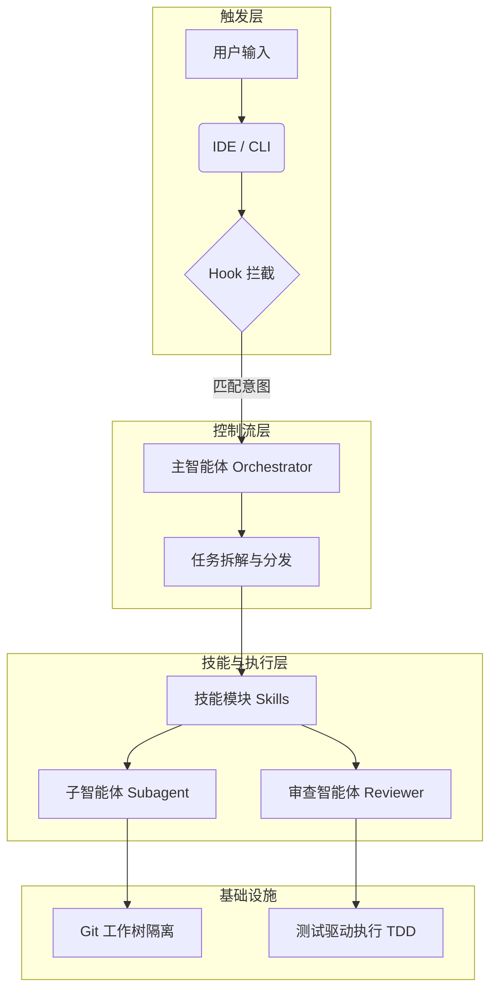
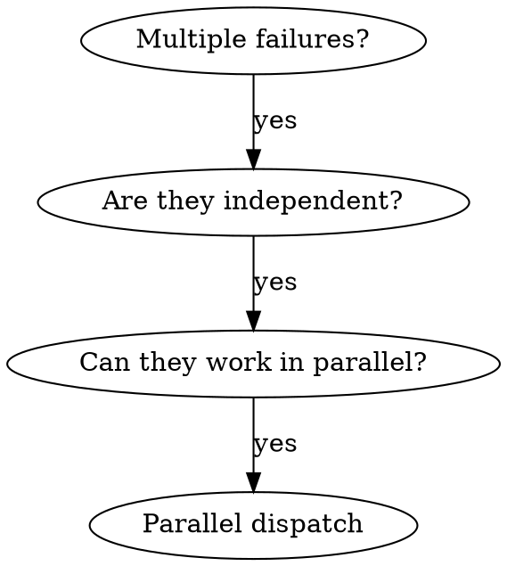
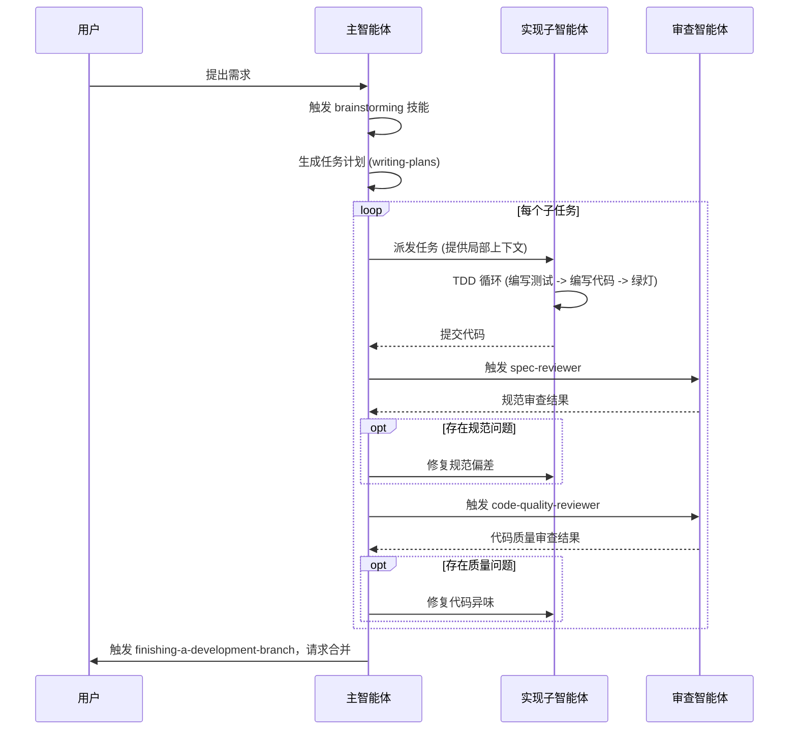

# 让 AI 变成工程团队：superpowers 工作流的架构与实战深度解析

## 目录

- [1. 项目简介](#1-项目简介)
- [2. 系统架构分析](#2-系统架构分析)
- [3. 核心模块代码深度解析](#3-核心模块代码深度解析)
  - [3.1 技能模块结构解剖](#31-技能模块结构解剖)
  - [3.2 智能体定义模块](#32-智能体定义模块)
  - [3.3 钩子与命令模块](#33-钩子与命令模块)
- [4. 核心功能执行流程分析](#4-核心功能执行流程分析)
  - [4.1 任务规划与头脑风暴](#41-任务规划与头脑风暴)
  - [4.2 任务派发与代码实现](#42-任务派发与代码实现)
  - [4.3 质量审查与代码合并](#43-质量审查与代码合并)
- [5. Skill 文档的测试方法](#5-skill-文档的测试方法)
  - [5.1 测试驱动的技能开发](#51-测试驱动的技能开发)
  - [5.2 测试执行与验证](#52-测试执行与验证)
- [6. 实战演练：基于 Superpowers 开发新功能](#6-实战演练基于-superpowers-开发新功能)
  - [6.1 阶段一：需求澄清与头脑风暴](#61-阶段一需求澄清与头脑风暴)
  - [6.2 阶段二：生成执行计划](#62-阶段二生成执行计划)
  - [6.3 阶段三：子智能体驱动开发与测试驱动](#63-阶段三子智能体驱动开发与测试驱动)
  - [6.4 阶段四：分支收尾与集成](#64-阶段四分支收尾与集成)
- [7. 总结](#7-总结)

---

## 1. 项目简介

`superpowers` 是为 AI 编码智能体（如 `Claude Code`、`Cursor`、`Codex` 等）提供完整软件开发工作流的插件和技能 (`Skill`) 集合。项目通过引入“子智能体驱动开发 (`SDD`)”模式，强制 AI 在编写代码前进行需求澄清与任务拆解。核心特性包括：**测试驱动开发 (`TDD`)**的强制执行、**双阶段代码审查**（规范审查与质量审查），以及通过**隔离的 Git 工作树**和**独立子智能体**避免长上下文污染。该设计将 AI 从单纯的代码生成器转变为遵循严谨工程规范的虚拟开发团队。

---

## 2. 系统架构分析

项目采用高度解耦的声明式架构，核心逻辑由 Markdown 编写的技能约束定义，而非传统可执行代码。系统自上而下分为触发层、控制流层、技能执行层与基础设施层。



## 3. 核心模块代码深度解析

系统核心由技能定义、独立审查智能体以及平台拦截钩子三部分组成，共同保障代码生成的规范性与可靠性。

### 3.1 技能模块结构解剖

`SKILL.md` 是项目的核心执行契约，由高度结构化的“人设与工作流约束”构成。以下提取 [`dispatching-parallel-agents/SKILL.md`](../skills/dispatching-parallel-agents/SKILL.md) 的骨架作为示例：

````markdown
## <!-- 该代码块展示了 dispatching-parallel-agents 技能的核心定义结构，包含触发条件与执行流程 -->

name: dispatching-parallel-agents
description: Use when facing 2+ independent tasks that can be worked on without shared state or sequential dependencies

---

# Dispatching Parallel Agents

## Overview

When you have multiple unrelated failures (different test files, different subsystems, different bugs), investigating them sequentially wastes time. Each investigation is independent and can happen in parallel.
**Core principle:** Dispatch one agent per independent problem domain. Let them work concurrently.

## When to Use



## The Pattern

### 1. Identify Independent Domains

Group failures by what's broken.

### 2. Create Focused Agent Tasks

Each agent gets: Specific scope, Clear goal, Constraints, Expected output.

### 3. Dispatch in Parallel

// In Claude Code / AI environment
Task("Fix agent-tool-abort.test.ts failures")
Task("Fix batch-completion-behavior.test.ts failures")

### 4. Review and Integrate

When agents return: Read each summary, Verify fixes don't conflict, Run full test suite.

## Common Mistakes

❌ Too broad: "Fix all the tests" - agent gets lost
✅ Specific: "Fix agent-tool-abort.test.ts" - focused scope
````

通过对比上述示例与项目中的其他技能文件 (如 [`systematic-debugging/SKILL.md`](../skills/systematic-debugging/SKILL.md) )，我们可以归纳出编写一个标准技能 (`Skill`) 所必须遵循的结构范式：

- **Frontmatter 元数据**：每个技能必须以 YAML 格式的 `name` 和 `description` 开头。这是系统进行意图匹配和触发技能的唯一依据。例如，当用户要求“处理多个独立的测试失败”时，系统会根据这段描述来自动挂载 `dispatching-parallel-agents` 技能。
- **Overview & Core Principle (概述与核心原则)**：开宗明义地指出该技能要解决的核心问题以及不可妥协的底线。如示例中的核心原则是“为每个独立问题域分配一个代理并并发执行”。
- **When to Use (决策树/适用场景)**：通常使用 Mermaid 或 DOT 语法绘制的决策流 (`Digraph`)，明确告诉 AI 在何种上下文下才允许调用此技能 (如必须是多个失败且无状态共享)，以此防止技能滥用。
- **The Pattern / The Process (核心状态机与阶段)**：这是技能的执行引擎。它将复杂的任务强制拆解为线性的、不可跳过的步骤。示例中展示了识别、创建任务、并行分发和最后集成的标准 4 步模式。
- **Red Flags / Common Mistakes (禁忌清单与反模式)**：明确列出 AI 常犯的“合理化借口”和“绝对不能做”的事项。如示例中明确指出，给 AI 分发“修复所有测试”这样宽泛的任务是错误的 (❌)，必须指定具体的文件 (✅)。
- **Integration (生态整合)** (部分复杂技能包含)：指明该技能需要与其他哪些技能配合使用。

### 3.2 智能体定义模块

项目在 [`agents/`](../agents/) 目录下定义了具有特定人设和约束的独立 AI 实例，确保代码生成与代码审查的关注点隔离。以 [`code-reviewer.md`](../agents/code-reviewer.md) 为例，该审查员被设定为高级代码审查员，通过明确的 Prompt 约定其核心审查维度：

- **计划对齐分析 (Plan Alignment Analysis)**：对比实现代码与原始计划文档，识别偏差，并评估偏差是“合理的改进”还是“有问题的背离”。
- **代码质量评估 (Code Quality Assessment)**：检查代码的组织结构、命名规范、错误处理机制、类型安全以及测试覆盖率，排查潜在的安全与性能问题。
- **架构设计审查 (Architecture and Design Review)**：确保代码遵循 SOLID 原则，保持关注点分离和低耦合，同时评估其可扩展性。
- **分级反馈与沟通协议**：审查意见必须严格按照“致命 (Must fix)、重要 (Should fix)、建议 (Nice to have)”三级分类输出；若发现严重偏离计划，必须要求代码生成智能体进行确认和修改。

### 3.3 钩子与命令模块

平台集成依赖于钩子拦截和快捷命令。

- **全局上下文注入**：[`hooks/session-start`](../hooks/session-start) 脚本在会话初始化时被触发。它通过 Bash 脚本读取 [`skills/using-superpowers/SKILL.md`](../skills/using-superpowers/SKILL.md) 的内容，并使用特定格式 (如 Cursor 的 `additional_context` 或 Claude Code 的 `hookSpecificOutput`) 将其注入为全局 `<EXTREMELY_IMPORTANT>` 上下文，从而让智能体在对话伊始就“知道”自己拥有调用技能的能力。
  - 文件名说明：在部分版本/环境中脚本名为 [`hooks/session-start.sh`](../hooks/session-start.sh)；请以仓库实际文件为准。
- **规范化引导指令**：[`commands/`](../commands/) 目录下的 [`brainstorm.md`](../commands/brainstorm.md) 包含系统性提问的提示词，要求 AI 扮演资深产品经理/架构师，采用苏格拉底式提问来精炼用户需求，强制其在生成任何代码或计划前，先澄清所有的歧义与假设。

---

## 4. 核心功能执行流程分析

子智能体驱动开发 (`SDD`) 涵盖从意图对齐到代码合并的完整闭环，通过多角色接力确保代码质量。

### 4.1 任务规划与头脑风暴

主智能体首先触发 `brainstorming` 技能，通过多轮对话澄清用户需求。需求确定后，调用 `writing-plans` 技能将目标拆解为粒度为 2-5 分钟的原子任务，并输出包含精确文件路径和验证步骤的计划文档至 `docs/superpowers/plans/` 目录。

### 4.2 任务派发与代码实现

针对计划中的每个任务，主智能体派发一个全新的实现者子智能体 (隔离上下文)。该子智能体必须遵循 `test-driven-development` 技能，执行“红-绿-重构”循环：先编写失败的测试用例，再编写极简代码使其通过，最后进行提交和自我审查。

### 4.3 质量审查与代码合并

实现者提交代码后，系统依次调用两级审查：首先由规范审查子智能体核对代码是否满足原计划需求，无遗漏或过度设计；通过后，再由质量审查子智能体评估代码风格与健壮性。任何阶段发现问题均会打回要求修复。全部任务完成后，触发 `finishing-a-development-branch` 技能进行最终测试验证与分支合并。



---

## 5. Skill 文档的测试方法

本章介绍如何通过测试驱动开发 (`TDD`) 理念编写和验证技能文档，确保智能体准确执行技能约束。

### 5.1 测试驱动的技能开发

技能文档开发需遵循红灯、绿灯和重构循环。编写技能前，必须先编写失败的测试用例。

具体流程如下：

- **红灯阶段**：设计包含多种压力的测试场景，在不加载目标技能的情况下运行智能体。记录其违背规范的基线行为。
- **绿灯阶段**：编写极简的技能文档，明确核心原则和适用场景。再次运行测试，验证智能体在技能的约束下是否能够规范执行。
- **重构阶段**：分析测试中出现的新的合理化借口，进一步完善技能文档以堵住漏洞。

### 5.2 测试执行与验证

项目在 `tests/claude-code/` 目录下提供了基于真实交互的自动化集成测试框架，以验证技能有效性。

```bash
# 运行针对子智能体驱动开发的集成测试
# 注意：必须在 superpowers 插件目录下运行
cd tests/claude-code
./test-subagent-driven-development-integration.sh
```

该集成测试会启动真实的 Claude Code 会话，派发多个子智能体执行计划。测试脚本通过断言检查会话的输出日志是否包含预期行为模式，或避免了特定禁忌操作。

---

## 6. 实战演练：基于 Superpowers 开发新功能

本章通过“为项目添加一个新的 `markdown-linter` 技能”场景，演示如何利用 `superpowers` 工作流与大模型高效结对编程。

> [!IMPORTANT]
> 环境与安装（简要）
>
> - 已安装 Claude Code CLI（`claude --version` 可运行）。
> - 已安装并启用 superpowers 插件（安装与更新见项目 README）。
> - 启用本地 dev marketplace：在 `~/.claude/settings.json` 中设置 `"superpowers@superpowers-dev": true`。
> - 从 superpowers 插件目录运行相关脚本与测试。
>
> 快速自检：
>
> ```bash
> # 验证 Claude Code CLI 是否可用
> claude --version
> # 预期输出：形如 1.2.3 的版本号
>
> # 验证本地是否存在 superpowers 插件目录（路径因平台而异，以下为示例）
> ls ~/.claude/plugins | grep superpowers || echo "未检测到 superpowers 插件"
> # 预期输出：superpowers
>
> # 检查是否已启用本地 dev marketplace
> grep -n 'superpowers@superpowers-dev' ~/.claude/settings.json || echo "未开启本地 marketplace"
> # 预期输出：包含 superpowers@superpowers-dev 的行号与配置内容
> ```

本实战的目标与成功标准：

- 目标：新增 `skills/markdown-linter/SKILL.md` 并完成一个能识别与修复“中英文空格缺失”的端到端流程。
- 产出：`skills/markdown-linter/SKILL.md`、`tests/test-md-linter.sh`、测试通过记录与会话概述。
- 成功标准：测试脚本通过；会话输出包含“技能生效、按规则修复”的证据；审查环节无 Must Fix 级别问题。

### 6.1 阶段一：需求澄清与头脑风暴

编码前须通过多轮对话对齐原始需求，消除歧义。

**用户输入**：“我想写一个新技能，用来自动检查和修复 Markdown 文档中的格式问题，比如中英文之间必须有空格。”

此时，AI 不会立刻开始写代码，而是匹配到 `brainstorming` 技能。
**AI 的反应**：扮演产品架构师，向用户提出关键问题以消除歧义：

1. 这个 Linter 是基于正则表达式自己实现，还是封装现有的工具 (如 `markdownlint`)？
2. 是否需要支持一键自动修复 (`Auto-fix`) 功能？
3. 这个技能是作为独立的验证步骤，还是集成到现有的 `code-quality-reviewer` 流程中？

**结果**：经过几轮简短对话，双方对齐了目标——基于现有的正则替换写一个独立的技能，支持自动修复。

### 6.2 阶段二：生成执行计划

在需求明确后，AI 调用 `writing-plans` 技能，将目标拆解为粒度极细的原子任务。

**生成的计划 (摘要)**：

- **Task 1**：在 `tests/` 下编写测试脚本 `test-md-linter.sh`，准备一个包含格式错误的测试用例文档，并断言 AI 能否正确发现问题 (体现了 RED-GREEN-REFACTOR 理念)。
- **Task 2**：在 `skills/markdown-linter/` 下创建 `SKILL.md`，定义检查规则和修复指令。
- **Task 3**：运行测试，验证新技能的有效性。

验收标准：

- 任务产物齐全且路径正确；
- 测试首次运行失败 (RED) 且原因与预期一致；
- 技能最小实现后再次运行通过 (GREEN)，并能解释修复逻辑；
- 代码与文档通过规范与质量两级审查。
- 测试脚本退出码为 0（`echo $?` 为 0）；
- 测试日志包含预期断言关键字（如 `PASS`、`GREEN`、`修复完成` 等）。

### 6.3 阶段三：子智能体驱动开发与测试驱动

主智能体按执行计划派发子智能体，并严格执行测试驱动开发循环。

用户输入：“/execute-plan”，触发 `subagent-driven-development`。

**执行 Task 1 (编写测试)**：

主智能体派发**实现者子智能体 (Implementer)**。它只拿到 Task 1 的要求。

- **动作**：创建了 `tests/test-md-linter.sh`。
- **验证**：运行该脚本，不出所料，由于技能还未编写，测试失败 (达到 TDD 的 RED 状态)。
- **审查**：主智能体派发**规范审查子智能体 (Spec Reviewer)**，确认测试用例涵盖了“中英文空格缺失”的场景。

**执行 Task 2 (编写技能)**：
主智能体派发一个新的实现者子智能体。

- **动作**：编写 `skills/markdown-linter/SKILL.md`，使用强制性语言规定了 AI 遇到 Markdown 时的处理范式。
- **验证**：子智能体自我审查完成。

**执行 Task 3 (验证通过)**：
主智能体要求子智能体再次运行 `tests/test-md-linter.sh`。

- **结果**：AI 在新技能的约束下，成功修复了测试用例中的格式错误，测试通过 (达到 TDD 的 GREEN 状态)。

### 6.4 阶段四：分支收尾与集成

所有任务完成后，触发 `finishing-a-development-branch` 技能进入收尾阶段。

1. 再次运行全量测试，确保新技能没有破坏其他流程。
2. 总结本次变更：“新增了 `markdown-linter` 技能，并补充了相应的回归测试”。
3. 询问用户：“所有检查通过，是否需要我为您生成 Conventional Commits 并提交，或者创建 PR？”

> [!TIP]
> 常见问题与排查
>
> - 测试长时间无输出：检查是否在插件目录运行、网络与 CLI 可用性。
> - 技能未生效：确认 `SKILL.md` frontmatter 的 `name/description` 是否存在且描述明确；检查会话是否成功加载技能上下文。
> - 审查未通过：按 Must Fix → Should Fix → Nice to Have 优先级逐条修正，再次运行测试与审查。
> - 扩展练习：将规则扩展到标题语言规范与标点/空格一致性；为新用例加入对应测试脚本或纳入 `run-skill-tests.sh`，并记录通过日志。

**总结**：在整个实战过程中，用户只需在最开始参与需求对齐，并在最后确认合并。中间繁杂的测试编写、代码生成、规范核对、自我修复全部由多个被精确控制的子智能体在隔离的上下文中自动完成。

---

## 7. 总结

superpowers 面向 AI 编码智能体，提供规范化的软件开发工作流：以声明式 `SKILL.md` 为核心，通过会话钩子注入上下文并以审查/实现子智能体编排流程，将开发活动产品化；在工程机制上强制 TDD 与双阶段审查，隔离子智能体上下文并支持并行调度，结合隔离的 Git 工作树与基于真实交互的技能验证确保安全、可验证的迭代；落地路径为“写计划 → 在隔离工作树按计划执行 → 运行技能与集成测试验证 → 审查通过后收尾合并”。
