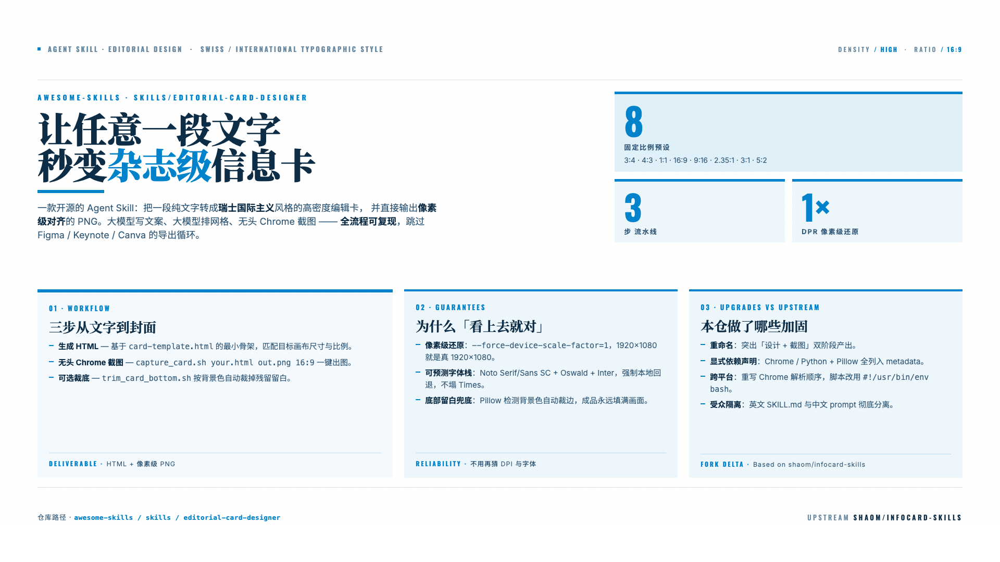

# 告别 Figma 手动排版：一句命令，让文字秒变杂志级封面

> 一款开源的 Agent Skill：把一段纯文字转成瑞士国际主义风格的高密度编辑卡，并直接输出像素级对齐的 PNG。

## 先看效果

下面这张信息卡，从纯文字到成品，只花了一条命令的时间。排版、字体、网格全部自动完成，没有打开任何设计软件。



如果大家在运营公众号、维护技术博客，或者每周都要交付产品演示图，大概率都踩过这个循环：打开 Figma，调网格、换字体、折腾导出分辨率。半小时后，封面还是差点意思。

[`editorial-card-designer`](https://github.com/ForceInjection/awesome-skills/tree/main/skills/editorial-card-designer) 技能 —— 收录于 [`awesome-skills`](https://github.com/ForceInjection/awesome-skills) 仓库 —— 把整套流程压缩成**一条命令**，同时强制让产出符合**现代杂志编辑设计（Editorial Design）**与**瑞士国际主义平面设计风格（Swiss / International Typographic Style）**的视觉语言。

大模型写文案、大模型排网格、无头 Chrome 截图 —— 全流程可复现。

## 它到底做了什么？

给它一段文字或若干要点，它会返回：

- 一份**自成体系的 HTML 文件**，基于编辑式骨架搭建（Hero + Stats + 主/次模块 + 页脚条带）。
- 一张**严格按目标比例对齐的 PNG 截图**。

内置 8 种固定比例预设，分别对应不同的发布场景：

| 比例     | 像素预设    | 典型场景                     |
| -------- | ----------- | ---------------------------- |
| `3:4`    | 竖版信息卡  | 公众号长图封面               |
| `4:3`    | 横版信息卡  | 经典幻灯片                   |
| `1:1`    | 方形贴文    | 小红书 / Instagram 信息流    |
| `16:9`   | `1920×1080` | 公众号宽封面、Keynote 开场图 |
| `9:16`   | 竖封        | Story / Reel / Shorts        |
| `2.35:1` | 电影级宽条  | Hero 横幅                    |
| `3:1`    | 横向 Banner | 个人主页头图                 |
| `5:2`    | 超宽条带    | 章节分隔条                   |

更关键的是：每种比例都在 [`references/recommended-skeletons.md`](https://github.com/ForceInjection/awesome-skills/tree/main/skills/editorial-card-designer/references/recommended-skeletons.md) 里配套了**专属版式骨架**。技能**不会**偷懒地把同一套布局硬缩放到所有比例 —— 它为每张画布挑选真正适配它的版式。

## 为什么产出的卡片「看上去就对」？

有三个工程化决策，是大多数手搓方案常常忽略的：

**1. 像素级还原。**
[`scripts/capture_card.sh`](https://github.com/ForceInjection/awesome-skills/tree/main/skills/editorial-card-designer/scripts/capture_card.sh) 调用无头 Chrome 时强制 `--force-device-scale-factor=1`，确保「1920×1080」就是真的 1920×1080 —— 没有隐藏的 2 倍 DPR 模糊。

**2. 可预测的字体体系。**
默认字体栈将 `Noto Serif SC` / `Noto Sans SC`（中文正文）与 `Oswald` / `Inter`（拉丁展示字 + UI）组合使用，统一来自 Google Fonts。**同时强制声明本地回退字体栈**，所以即便网络抖动，也不会让版式悄悄塌回 Times New Roman。

**3. 底部留白兜底。**
由于无头 Chrome 的字体渲染与常规浏览器存在细微差异，页脚偶尔会被裁出视口。`capture_card.sh` 内部已预留 120px 高度缓冲确保完整捕获；后处理脚本 [`scripts/trim_card_bottom.sh`](https://github.com/ForceInjection/awesome-skills/tree/main/skills/editorial-card-designer/scripts/trim_card_bottom.sh)（依赖 Python + Pillow）再按固定像素 `--bottom 120` 精确裁回目标尺寸 —— 最终成品永远填满画面。

## 三步工作流

```bash
# 步骤 1：让 Agent 生成一份与目标画布严格匹配的 HTML
#        （例如 16:9 对应 1920×1080）。从 assets/card-template.html 的
#        最小骨架开始，填入标题、摘要、模块与页脚条带。

# 步骤 2：用无头 Chrome 截图（脚本内部已预留 120px 高度缓冲，防止字体渲染差异导致页脚被裁）
./skills/editorial-card-designer/scripts/capture_card.sh \
    path/to/your-card.html path/to/your-card.png 16:9

# 步骤 3（推荐）：按固定像素裁掉 120px 底部缓冲，恢复精确目标尺寸
#        —— 若跳过此步，成品高度将为目标值 +120px（例如 1920×1200）。
./skills/editorial-card-designer/scripts/trim_card_bottom.sh \
    path/to/your-card.png path/to/your-card.trimmed.png --bottom 120
```

整条流水线到此结束。没有设计工具、没有手动导出对话框、不用再猜 DPI。

## 本仓库相比上游做了哪些改动？

技能基于 [`shaom/infocard-skills`](https://github.com/shaom/infocard-skills) 改造而来，本仓库做了以下几项加固：

- **重命名**：从 `editorial-card-screenshot` 改为语义更清晰的 [`editorial-card-designer`](https://github.com/ForceInjection/awesome-skills/tree/main/skills/editorial-card-designer)，突出「设计 + 截图」双阶段产出，而不仅仅是截图。
- **补齐依赖声明**：在 `SKILL.md` 的 `metadata.clawdbot.requires` 中显式声明 Chrome / Chromium 二进制依赖，以及 `trim_card_bottom.sh` 需要的 Python + Pillow 可选依赖。
- **加固跨平台能力**：重写 [`scripts/capture_card.sh`](https://github.com/ForceInjection/awesome-skills/tree/main/skills/editorial-card-designer/scripts/capture_card.sh) 的 Chrome 可执行文件解析顺序；两个 shell 脚本都改用 `#!/usr/bin/env bash`，在最小化 Linux 镜像中也能开箱即用。
- **受众隔离**：面向 Agent 的英文 `SKILL.md` 与面向中文创作场景的 [`references/editorial-card-prompt.md`](https://github.com/ForceInjection/awesome-skills/tree/main/skills/editorial-card-designer/references/editorial-card-prompt.md) 彻底分离。

## 仓库中已有一个真实示例

为了让新用户在动手前先「看见」产出的形态，本仓库在 [`examples/editorial-card-designer/`](https://github.com/ForceInjection/awesome-skills/tree/main/examples/editorial-card-designer) 下沉淀了一份完整示例：

- [`editorial-card-designer-intro.html`](./editorial-card-designer-intro.html) —— 完整源 HTML，可直接在浏览器中打开，也可以 fork 一份二次调样式。
- [`editorial-card-designer-intro.png`](./editorial-card-designer-intro.png) —— 先用 `capture_card.sh` 截图、再经 `trim_card_bottom.sh --bottom 120` 裁剪得到的 1920×1080 PNG 成品。

源文本是哪段？正是本文件本身。一段关于 `editorial-card-designer` 技能的介绍文字，被技能转换成了一张可扫视、网格驱动的 16:9 封面 —— 用技能的产出物来介绍技能自己。

后续本仓库新增的信息卡示例会统一沉淀到该目录，逐步构建起一个**版式 × 比例 × 内容密度**三维度的可检索参考集。下次找灵感，你不再需要在泛化的「设计模板」中翻找 —— 直接挑一张信息密度已经与你内容对齐的骨架即可。

## 谁最应该立刻试一试？

- **公众号编辑**：每周要产出多张封面，希望建立可复用的视觉语言。
- **开发者布道师**：受够了手动导出幻灯片头图。
- **技术写作者**：需要给长文配上图解式开场图。
- **任何构建 Agent 流水线的人**：交付物不只是文字，还包含图像。

花 5 分钟试一试：

```bash
git clone https://github.com/ForceInjection/awesome-skills.git
cd awesome-skills/skills/editorial-card-designer
```

然后让 Agent 读取 `SKILL.md`，大家会立刻理解本文的每一段描述。

---

**仓库路径** `awesome-skills` → `skills/editorial-card-designer/`

**上游致谢** [`shaom/infocard-skills`](https://github.com/shaom/infocard-skills)
