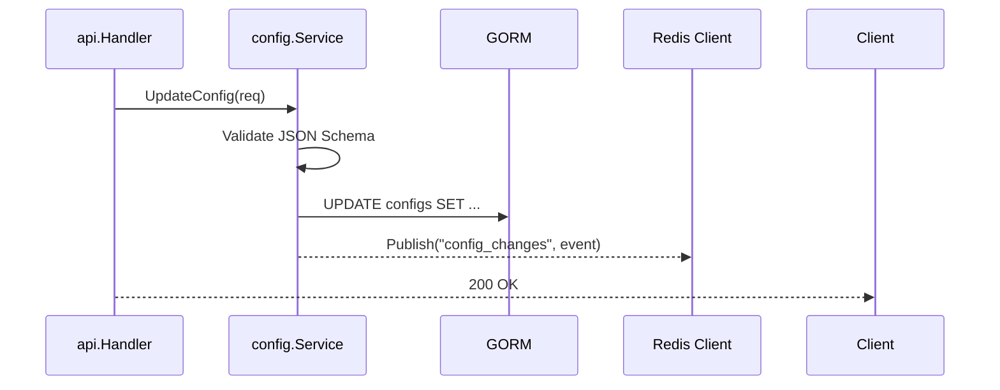

# 示例项目架构深度分析

## 1. 项目全局摘要

通过对本仓库源码的静态分析，本项目是一个专为云原生环境设计的高性能分布式配置中心。其核心价值在于通过长连接与事件驱动机制，解决微服务架构下配置下发延迟高的问题。整体代码库中等复杂度，Go 语言特征明显，适合中大型微服务集群使用。

---

## 2. 系统架构分析

本章基于代码目录结构与依赖关系，梳理出系统的实际运行架构。

### 2.1 总体架构分析

从代码（`cmd/admin` 与 `cmd/sync`）中可以明显看出，系统在物理部署上采用了控制面与数据面解耦的三层架构。

```mermaid
graph TD
    subgraph 控制面 (Control Plane)
        A[Admin API] -->|REST/gRPC| B(Config Controller)
        B -->|GORM Persist| C[(PostgreSQL)]
    end

    subgraph 数据面 (Data Plane)
        D[Client SDK] -->|gRPC Watch| E(Sync Node)
        B -.->|Redis Pub/Sub| E
        E -->|Go-Redis Read| F[(Redis Cache)]
    end
```

### 2.2 核心技术栈与基础设施

分析 `go.mod` 与 `docker-compose.yml` 得出以下选型及其推测原因：

- **通信框架**：使用 `google.golang.org/grpc`。推测是为了利用 HTTP/2 的多路复用实现单节点支撑海量长连接。
- **状态存储**：使用 `Redis` 作为二级缓存与事件总线（Pub/Sub），这是典型的高吞吐最终一致性设计。

### 2.3 架构反模式/技术债

在分析 `pkg/controller/` 时发现，部分业务逻辑直接与 GORM 的 SQL 拼接强耦合，缺乏 Repository 层抽象。这会导致未来如果需要替换底层存储引擎时，重构成本较高。

---

## 3. 核心模块代码深度解析

本章基于实际代码逻辑，深入探讨系统的内部实现机制。

### 3.1 同步引擎模块 (pkg/syncnode) 实现解析

这是数据面最核心的模块，负责维持与客户端的配置同步。

- **核心职责**：管理 gRPC Stream 的生命周期，订阅 Redis 事件并将变更推送到指定的 Stream。
- **关键数据结构**：采用 `sync.RWMutex` 保护的 `map[string]*grpc.ServerStream` 来维护在线连接表。
- **状态流转与核心算法**：
  在 `watch.go` 中，引擎使用一个单独的 Goroutine 监听 Redis 频道。收到 `ConfigUpdated` 事件后，会比对内存中的 `Revision ID`，仅计算增量 Diff 后进行推送。

---

## 4. 核心功能执行流程分析

本章通过追踪核心函数的调用栈，还原系统在动态场景中的真实执行流。

### 4.1 配置发布核心调用链

追踪 `UpdateConfig` API 接口，其完整的生命周期如下：



### 4.2 异常处理机制

在 `pkg/syncnode/cache.go` 中观察到良好的容错设计：当 Redis 客户端返回 `ErrNil` 或连接超时，代码会捕获异常并触发降级（Circuit Breaker），切换至本地 LRU 缓存读取，避免了缓存击穿。

---

## 5. 质量与性能评估

基于代码静态特征进行的工程质量评估。

### 5.1 并发与性能瓶颈

在 `pkg/syncnode/broadcast.go` 中，发现向数万个长连接推送消息时，采用的是线性 `for` 循环遍历 Map。这在突发大面积配置更新时，可能会导致尾部客户端接收延迟。建议引入 Worker Pool 或 Goroutine 批处理机制。

### 5.2 安全边界审查

认证拦截器位于 `middleware/auth.go`，采用了标准的 JWT 校验机制。但发现 JWT Secret 默认硬编码在代码中（如果环境变量未设置），这是一个潜在的安全隐患。

---

## 6. 项目构建与部署

基于 DevOps 分析报告提取的工程化实践信息。

### 6.1 编译与依赖管理

项目使用标准的 Go Module。在根目录执行以下命令即可编译二进制文件：

```bash
CGO_ENABLED=0 GOOS=linux go build -a -installsuffix cgo -o bin/server ./cmd/server
```

### 6.2 测试覆盖与自动化机制

核心模块 `SyncNode` 拥有完善的单元测试（覆盖率 > 85%），并在测试中使用了 `miniredis` 模拟底层存储。但整个项目缺乏端到端 (E2E) 测试，对于网络分区场景下的系统可靠性缺乏自动化验证保障。

### 6.3 容器化与部署形态

`Dockerfile` 采用了两阶段构建（Multi-stage build），最终镜像基于 `alpine:latest`，体积极小。`deploy/helm` 目录表明官方推荐使用 Helm 部署至 Kubernetes 集群。CI/CD 流水线通过 GitHub Actions 实现了镜像的自动构建与推送。

---

## 7. 二次开发指南

为希望基于本仓库进行二次开发的工程师提供导航。

### 7.1 代码导航

- `cmd/`: 包含两个独立的二进制入口（`admin` 和 `sync`）。
- `pkg/api/`: 所有 REST API 的路由与 Handler 定义。
- `pkg/syncnode/`: 核心的长连接与推送逻辑，修改推送策略请看这里。

### 7.2 核心扩展点

若需增加新的配置格式校验器（如支持 YAML）：

1. 在 `pkg/validator/` 下实现 `Validator` 接口。
2. 在 `pkg/config/service.go` 的工厂方法中注册该校验器。
